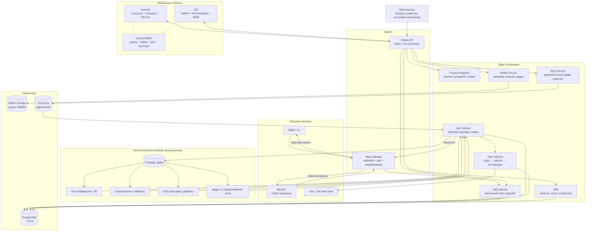

# 01 · Обзор системы «КВАНТ Скан»

> Мобильная платформа сбора первичных данных о единицах товара на складе:
> фотофиксация, обмер, чтение кодов, трассировка до оригинального поставщика.

## 1.1 Задача одним абзацем

Складская система порождает **задания на сканирование**. Задание прилетает на телефон
кладовщика/замерщика. Приложение **ведёт человека по шагам** («сфотографируй фронт»,
«поставь маркер и обмерь», «считай DataMatrix с шильдика»), сразу проверяет качество
каждого шага и складывает результат в локальную базу. Данные уезжают на сервер
надёжно и в фоне — **даже если сети на складе нет вообще**. На сервере из сырья
собирается карточка единицы товара с габаритами, медиа, кодами и связями
«код → партия → поставщик». Пользоваться могут и наши сотрудники, и сотрудники
клиентов — каждый видит только свой периметр.

## 1.2 Продуктовые требования, из которых выросла архитектура

| # | Требование заказчика | Архитектурное следствие |
|---|---|---|
| R1 | «Максимально глубокий анализ единиц товара» | Сохраняем **сырьё**, а не только результат: кадры, карты глубины, интринсики камеры, позы. Анализ пересчитывается на сервере новыми моделями без повторного выхода на склад (§05). |
| R2 | «Кладовщики следуют инструкциям приложения» | **Server-driven capture protocol**: сценарий съёмки — это версионируемые данные с сервера, а не код приложения (§03). |
| R3 | «Задания приходят из складской системы как триггеры» | **Inbound Task Gateway** с адаптерами (Bitrix24, 1С, произвольный WMS) + push как «звонок», а не как транспорт (§09). |
| R4 | «Система никогда не должна падать» | **Offline-first**: телефон — источник истины на смену. Плюс лестница деградации на каждом критичном шаге (§08). |
| R5 | «Предполагать внесение изменений» | Три оси расширения без релиза приложения: протоколы съёмки, серверные анализаторы, коннекторы (§1.5). |
| R6 | «Внутренние сотрудники и сотрудники заказчиков» | Мультитенантность с изоляцией на уровне строк + ABAC-политики + отдельный режим «гостевой тенант» (§07). |
| R7 | «Сразу вносить трассировку кодов и оригинальных поставщиков» | Домен `TraceLink` первого класса: GS1 (GTIN/SSCC/лот/серийник), «Честный знак», ГТД, привязка к поставщику с уровнем доверия (§06). |
| R8 | Android **и** iOS | Kotlin Multiplatform: общее ядро, нативный UI и нативный доступ к камере/AR. |

## 1.3 Карта системы

## 1.4 Пять несущих решений

### 1. Offline-first, устройство — источник истины
Кладовщик в холодном складе с металлическими стеллажами не имеет сети. Любая
архитектура, где «нажал → ушёл запрос → ждём ответ», на складе умирает. Поэтому:
каждое действие пишется в локальный SQLite **синхронно и до отправки**, а исходящая
очередь (outbox) доставляет его на сервер когда угодно позже. UI никогда не ждёт
сеть. Подробно — §04.

### 2. Сценарий съёмки — это данные, а не код
`CaptureProtocol` — версионируемый JSON-документ: список шагов, подсказки, критерии
приёмки. Приложение — интерпретатор этого документа. Новая категория товара, новое
требование заказчика, новый ракурс — это новая версия протокола, доставляемая
синхронизацией. **Релиз в сторах не нужен.** Подробно — §03.

### 3. Append-only события вместо CRUD
Клиент не «обновляет запись», а порождает неизменяемые события с `client_event_id`
(UUIDv7). Сервер применяет их идемпотентно. Двойная отправка безопасна, порядок
восстанавливается по `(session_id, seq)`, история не теряется, конфликты
разрешаются детерминированно. Побочная выгода — полный аудит «кто, когда, чем снял».

### 4. Сохраняем сырьё, а не выводы
Карта глубины, облако точек, интринсики и позы камеры хранятся вместе с кадрами.
Через год выйдет модель точнее — пересчитаем габариты по архиву, не отправляя людей
переобмерять склад. Это прямой ответ на R1 и главная защита от устаревания
«самых современных технологий».

### 5. Лестница деградации везде, где можно упасть
У каждой критичной способности есть упорядоченный набор реализаций от лучшей к
самой примитивной, и последняя ступень работает всегда. Обмер: LiDAR → ARCore Depth
→ маркер → рулетка с фотодоказательством. Задания: push → фоновый pull → ручное
обновление → офлайн-кэш. Идентификация: DataMatrix → штрихкод → OCR → ручной ввод.
Подробно — §08.

## 1.5 Три оси расширения (ответ на «система должна допускать изменения»)

| Ось | Что меняется | Кто меняет | Нужен ли релиз приложения |
|---|---|---|---|
| **Протоколы съёмки** | Шаги, подсказки, критерии качества, поля ввода | Технолог через web-консоль | Нет |
| **Серверные анализаторы** | Новые модели: дефекты, категории, 3D-реконструкция | Команда ML, деплой сервиса | Нет |
| **Коннекторы** | Новая складская система заказчика | Разработка адаптера в Gateway | Нет |
| Возможности устройства | Новый сенсор, новый способ обмера | Мобильная команда | Да |

Правило: **всё, что меняется чаще раза в квартал, должно жить в данных, а не в коде
приложения.** Мобильный релиз — самый дорогой и медленный способ доставить
изменение, поэтому он зарезервирован только для новых аппаратных возможностей.

## 1.6 Границы первой версии

**Входит:** задания, протоколы съёмки, гид по шагам, фото/видео, обмер (4 класса
точности), чтение кодов, офлайн-синхронизация, чанковая загрузка медиа, карточка
единицы товара, трассировка кодов и поставщиков, мультитенантность, web-консоль
контроля качества, адаптер Bitrix24.

**Не входит (осознанно отложено):** голосовой ввод, AR-навигация по складу,
собственная 3D-реконструкция на устройстве, оффлайн-ML тяжелее 50 МБ,
интеграция с весовым оборудованием, печать этикеток. Все они укладываются в
существующие точки расширения — см. §10.

## 1.7 Навигация по документации

| Документ | О чём |
|---|---|
| [02-domain-model.md](02-domain-model.md) | Сущности, состояния, инварианты |
| [03-capture-protocol.md](03-capture-protocol.md) | Протокол съёмки: формат, шаги, валидации |
| [04-sync-and-offline.md](04-sync-and-offline.md) | Офлайн, outbox, синхронизация, конфликты |
| [05-measurement.md](05-measurement.md) | Обмер: методы, классы точности, конвейер |
| [06-traceability.md](06-traceability.md) | Коды, партии, поставщики, доверие к данным |
| [07-security-multitenancy.md](07-security-multitenancy.md) | Тенанты, роли, внешние пользователи, устройства |
| [08-reliability.md](08-reliability.md) | SLO, режимы отказа, лестницы деградации |
| [09-integrations.md](09-integrations.md) | Приём заданий и обратная запись |
| [10-roadmap.md](10-roadmap.md) | Этапы, оценки, команда |
| [adr/](adr/) | Журнал архитектурных решений |
| [api/openapi.yaml](api/openapi.yaml) | Контракт REST API |
| [schemas/capture-protocol.schema.json](schemas/capture-protocol.schema.json) | JSON Schema протокола съёмки |
