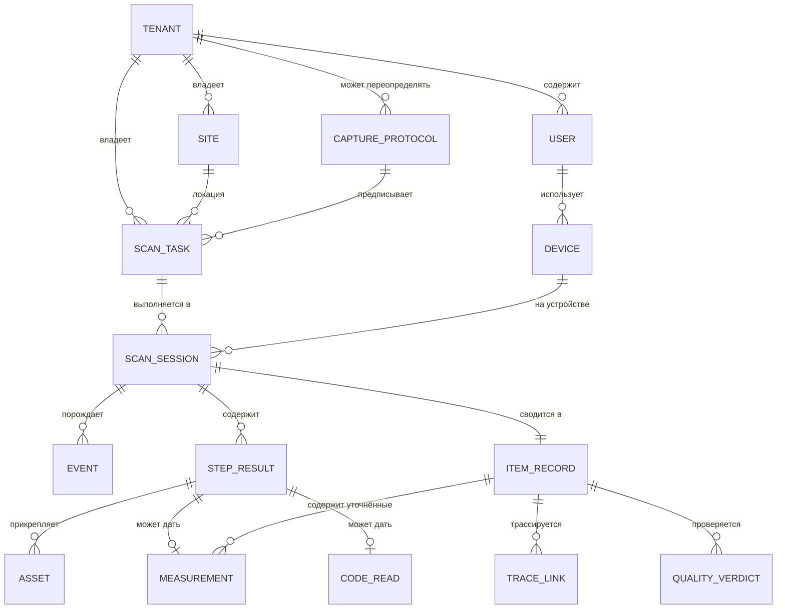
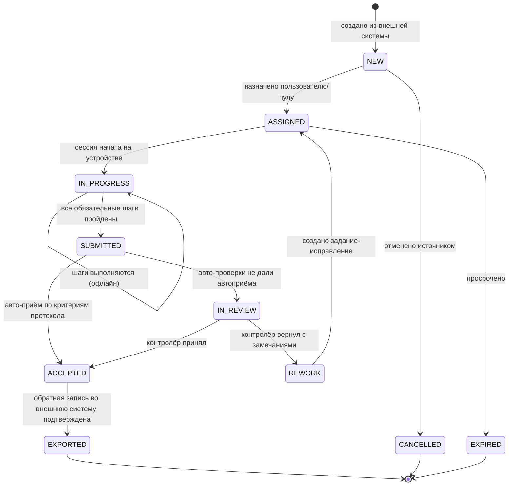
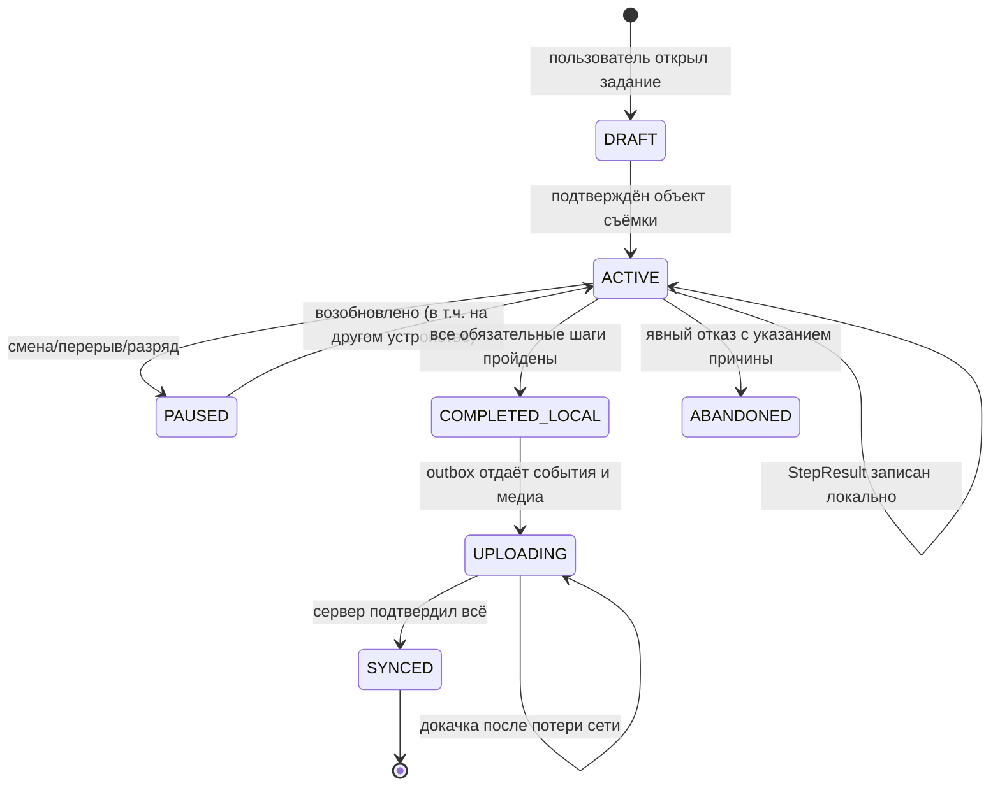

# 02 · Доменная модель

## 2.1 Словарь

| Термин | Определение |
|---|---|
| **Тенант** (`Tenant`) | Организация-владелец данных. Наш тенант — `internal`, тенант заказчика — `customer`. Строгая изоляция данных. |
| **Площадка** (`Site`) | Физический склад/цех. Задания и пользователи привязаны к площадкам. |
| **Задание** (`ScanTask`) | Единица работы: «снять эту единицу товара по этому протоколу». Приходит извне или создаётся вручную. |
| **Протокол съёмки** (`CaptureProtocol`) | Версионируемый сценарий: какие шаги пройти и как проверить результат. |
| **Сессия** (`ScanSession`) | Фактическое выполнение задания конкретным человеком на конкретном устройстве. |
| **Шаг** (`CaptureStep`) | Атомарное действие: снять фото, обмерить, считать код, ввести значение. |
| **Актив** (`Asset`) | Бинарный артефакт: кадр, видео, карта глубины, облако точек. |
| **Обмер** (`Measurement`) | Габариты с методом, классом точности и ссылкой на сырьё. |
| **Чтение кода** (`CodeRead`) | Распознанный/введённый идентификатор с разбором по GS1. |
| **Карточка единицы** (`ItemRecord`) | Сводный результат: агрегат по сессии, то, что уезжает в складскую систему. |
| **Трассировка** (`TraceLink`) | Связь «код ↔ партия ↔ оригинальный поставщик» с уровнем доверия. |
| **Событие** (`Event`) | Неизменяемый факт от клиента. Единственный способ изменить состояние сессии. |

## 2.2 Диаграмма сущностей



## 2.3 Ключевые инварианты

Инварианты — это то, что система обязана удерживать всегда. Нарушение = баг данных,
а не «редкий случай».

1. **I-1 · Сырьё не удаляется до подтверждения.** Локальный `Asset` не удаляется с
   устройства, пока сервер не подтвердил приём и сверку `sha256`.
2. **I-2 · Событие применяется ровно один раз.** `(tenant_id, client_event_id)` —
   уникальный ключ. Повторная доставка возвращает `duplicate`, а не создаёт дубль.
3. **I-3 · Сессия иммутабельна после `SUBMITTED`.** Изменение возможно только новой
   сессией-исправлением, связанной через `corrects_session_id`. История не переписывается.
4. **I-4 · Протокол пинуется на момент старта.** У сессии записана точная версия
   протокола. Публикация новой версии не ломает идущие сессии.
5. **I-5 · Обмер всегда знает свою родословную.** У `Measurement` обязательны `method`,
   `accuracy_class` и `source_asset_ids`. Габаритов «из ниоткуда» не существует.
6. **I-6 · Тенант не пересекает границу.** Любой запрос к данным несёт `tenant_id`;
   изоляция обеспечивается на уровне БД (RLS), а не только кодом приложения.
7. **I-7 · Трассировка помнит, кто её заявил.** У `TraceLink` есть `declared_by_tenant_id`
   и `confidence`. Данные от внешнего сотрудника заказчика никогда не выдаются за
   верифицированные нами.
8. **I-8 · Задание не теряется.** Переход `ScanTask` в терминальное состояние
   происходит только после подтверждённой обратной записи во внешнюю систему либо
   явного решения оператора.

## 2.4 Жизненный цикл задания



Важное свойство: **устройство знает только про `ASSIGNED → IN_PROGRESS → SUBMITTED`.**
Всё, что дальше, — серверная зона ответственности. Клиент не должен уметь ставить
`ACCEPTED`: это исключает целый класс расхождений между устройствами.

## 2.5 Жизненный цикл сессии на устройстве



`PAUSED → ACTIVE` на **другом устройстве** — это требование реальной смены: телефон
разрядился, работу продолжает коллега. Реализуется тем, что состояние сессии —
это лог событий, который можно доиграть где угодно (§04.6).

## 2.6 Модель данных: таблицы ядра

Ниже — сокращённый DDL для PostgreSQL. Полная схема — в `backend/app/schema.sql`.

```sql
-- Каждая доменная таблица несёт tenant_id и защищена RLS.
CREATE TABLE scan_task (
  id                UUID PRIMARY KEY,
  tenant_id         UUID NOT NULL REFERENCES tenant(id),
  site_id           UUID REFERENCES site(id),
  external_system   TEXT,                 -- 'bitrix24' | '1c' | 'wms-acme'
  external_ref      TEXT,                 -- идентификатор в системе-источнике
  protocol_code     TEXT NOT NULL,
  protocol_version  INT,                  -- NULL = взять активную на момент старта
  subject           JSONB NOT NULL,       -- sku, gtin, наименование, ожидаемое кол-во, ячейка
  priority          SMALLINT NOT NULL DEFAULT 100,
  due_at            TIMESTAMPTZ,
  assignee_user_id  UUID REFERENCES app_user(id),
  assignee_pool     TEXT,                 -- если задание в пул, а не на человека
  state             TEXT NOT NULL,
  created_at        TIMESTAMPTZ NOT NULL DEFAULT now(),
  updated_at        TIMESTAMPTZ NOT NULL DEFAULT now(),
  UNIQUE (tenant_id, external_system, external_ref)   -- идемпотентность приёма
);

CREATE TABLE scan_session (
  id                UUID PRIMARY KEY,
  tenant_id         UUID NOT NULL,
  task_id           UUID NOT NULL REFERENCES scan_task(id),
  device_id         UUID NOT NULL,
  user_id           UUID NOT NULL,
  protocol_code     TEXT NOT NULL,
  protocol_version  INT  NOT NULL,        -- I-4: версия зафиксирована
  corrects_session_id UUID REFERENCES scan_session(id),
  state             TEXT NOT NULL,
  started_at        TIMESTAMPTZ NOT NULL,
  finished_at       TIMESTAMPTZ
);

CREATE TABLE session_event (
  tenant_id         UUID NOT NULL,
  session_id        UUID NOT NULL REFERENCES scan_session(id),
  seq               BIGINT NOT NULL,      -- монотонно в рамках сессии
  client_event_id   UUID NOT NULL,        -- UUIDv7, генерится устройством
  type              TEXT NOT NULL,
  payload           JSONB NOT NULL,
  device_ts         TIMESTAMPTZ NOT NULL, -- время устройства (может врать)
  server_ts         TIMESTAMPTZ NOT NULL DEFAULT now(),
  PRIMARY KEY (session_id, seq),
  UNIQUE (tenant_id, client_event_id)     -- I-2: идемпотентность
);

CREATE TABLE asset (
  id                UUID PRIMARY KEY,
  tenant_id         UUID NOT NULL,
  session_id        UUID NOT NULL,
  step_id           TEXT NOT NULL,
  kind              TEXT NOT NULL,        -- photo | video | depth_map | point_cloud | audio
  mime              TEXT NOT NULL,
  bytes             BIGINT NOT NULL,
  sha256            BYTEA NOT NULL,
  storage_key       TEXT,                 -- ключ в объектном хранилище
  capture_meta      JSONB NOT NULL,       -- интринсики, поза, EXIF, освещённость, blur
  upload_state      TEXT NOT NULL,        -- pending | uploading | complete | verified
  UNIQUE (tenant_id, sha256)              -- дедупликация одинаковых кадров
);

CREATE TABLE measurement (
  id                UUID PRIMARY KEY,
  tenant_id         UUID NOT NULL,
  session_id        UUID NOT NULL,
  method            TEXT NOT NULL,        -- lidar | ar_depth | marker | manual | photogrammetry
  accuracy_class    CHAR(1) NOT NULL,     -- A | B | C | D
  length_mm         NUMERIC(10,2),
  width_mm          NUMERIC(10,2),
  height_mm         NUMERIC(10,2),
  volume_mm3        NUMERIC(18,2),
  weight_g          NUMERIC(12,2),
  confidence        NUMERIC(4,3),
  source_asset_ids  UUID[] NOT NULL,      -- I-5
  refined_from      UUID REFERENCES measurement(id),
  created_at        TIMESTAMPTZ NOT NULL DEFAULT now()
);

CREATE TABLE trace_link (
  id                    UUID PRIMARY KEY,
  tenant_id             UUID NOT NULL,
  item_id               UUID NOT NULL REFERENCES item_record(id),
  code_type             TEXT NOT NULL,    -- gtin | sscc | serial | batch | chestny_znak | gtd
  code_value            TEXT NOT NULL,
  supplier_name         TEXT,
  supplier_inn          TEXT,
  supplier_ref          TEXT,             -- id в нашем справочнике контрагентов
  origin_country        CHAR(2),
  declared_by_tenant_id UUID NOT NULL,    -- I-7: кто заявил
  declared_by_user_id   UUID NOT NULL,
  confidence            TEXT NOT NULL,    -- verified | declared | inferred
  evidence_asset_ids    UUID[],
  created_at            TIMESTAMPTZ NOT NULL DEFAULT now()
);
```

## 2.7 Почему события, а не «обновить сессию»

Альтернатива — клиент PUT-ит текущее состояние сессии целиком. Она проще ровно до
первого офлайна. Проблемы, которые снимает событийная модель:

- **Двойная отправка.** Сеть моргнула, ответ не дошёл, клиент повторил. С PUT — либо
  потеря, либо дубль. С событиями — `client_event_id` делает повтор безопасным.
- **Продолжение на другом устройстве.** Состояние восстанавливается доигрыванием лога.
- **Частичная доставка.** 8 из 10 шагов уехали, телефон сел. С PUT состояние
  неконсистентно; с событиями сервер видит валидный префикс сессии.
- **Аудит.** Заказчик спросит «кто ввёл этого поставщика и когда». Ответ есть всегда.
- **Разбор инцидентов.** Сессию можно воспроизвести шаг в шаг.

Цена: сервер обязан уметь **сворачивать** события в состояние (проекция) и держать
эту логику единственным местом истины. Проекция реализована в
`backend/app/projections.py`, тот же порядок сворачивания повторён в KMP-ядре
(`shared/.../sync/SessionProjection.kt`) — клиент и сервер должны получать
одинаковый результат из одного лога.
