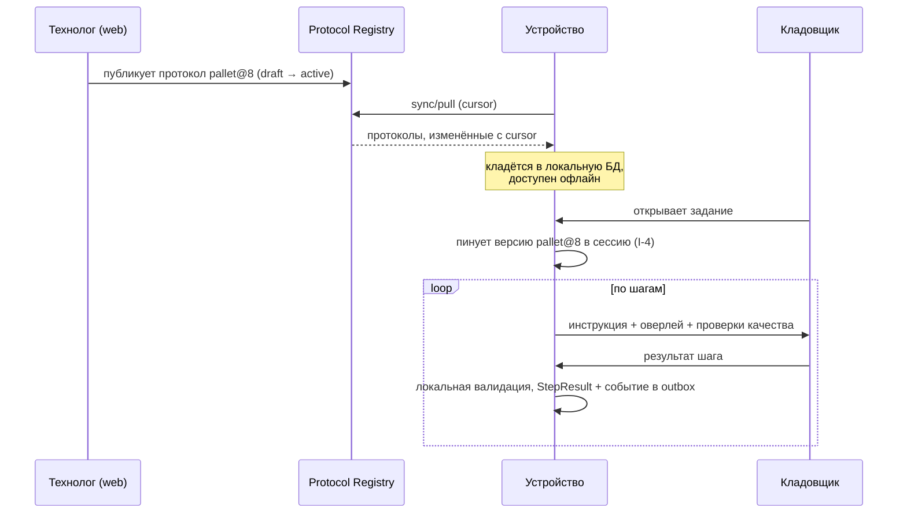

# 03 · Протокол съёмки (server-driven capture)

> Самый важный документ для расширяемости. Здесь описан механизм, благодаря которому
> «приложение ведёт кладовщика по шагам» меняется без релиза в сторах.

## 3.1 Идея

Приложение **не знает**, что такое «паллета», «холодильник» или «рулон кабеля».
Оно умеет исполнять восемь примитивов (фото, видео, обмер, код, форма, вес, заметка,
подтверждение) и подчиняется документу, который пришёл с сервера. Технолог собирает
из примитивов сценарий, публикует версию — и завтра кладовщики снимают по-новому.



## 3.2 Модель документа

```
CaptureProtocol
├─ code            стабильный идентификатор ("pallet_general")
├─ version         целое, монотонно растёт
├─ status          draft | active | deprecated
├─ scope           global | tenant:<id>          — тенант может переопределить общий протокол
├─ applies_to      категории/SKU-маски/площадки, для автоподбора
├─ settings        общие настройки исполнения
├─ steps[]         упорядоченный список шагов
└─ acceptance      критерии автоприёма результата
```

### Правила версионирования

- Версия **иммутабельна** после публикации. Правка = новая версия.
- Активной может быть ровно одна версия на `(code, scope)`.
- Сессия пинует версию на старте и доживает на ней до конца (I-4).
- `deprecated` версии остаются доступными для чтения вечно — иначе нельзя
  воспроизвести, по каким инструкциям снимали год назад.
- Протокол доставляется подписанным (Ed25519); устройство проверяет подпись перед
  применением. Это защита от подмены инструкций через скомпрометированный канал.

## 3.3 Примитивы шагов

| `kind` | Что делает | Ключевые параметры |
|---|---|---|
| `photo` | Кадр с проверкой качества | `quality`, `hint_overlay`, `repeat` |
| `video` | Короткий облёт объекта | `duration_s`, `require_motion` |
| `measure` | Обмер габаритов | `target`, `min_accuracy_class`, `marker` |
| `code` | Чтение кода | `symbologies`, `parse`, `allow_manual` |
| `form` | Ввод атрибутов | `fields[]` с типами и справочниками |
| `weight` | Вес (ручной или с весов по BLE) | `unit`, `source` |
| `note` | Свободный комментарий/голос | `allow_voice` |
| `confirm` | Подтверждение действия | `text`, `require_signature` |

Восемь примитивов покрывают все известные сценарии приёмки. Девятый добавляется
только когда появляется новая **аппаратная** способность — и это единственный
случай, когда нужен релиз приложения.

## 3.4 Проверки качества на устройстве

Проверка **до** отправки — это принципиально. Кладовщик уже стоит у товара; если
брак обнаружится на сервере через час, его придётся звать обратно. Поэтому каждый
шаг несёт машинные критерии, которые приложение считает локально:

| Критерий | Как считается на устройстве |
|---|---|
| `max_blur` | Дисперсия Лапласиана по кадру, нормированная |
| `min_lux` | Показание сенсора освещённости + средняя яркость кадра |
| `require_subject_fill_pct` | Доля кадра, занятая объектом (ML Kit Subject Segmentation) |
| `min_resolution_mp` | Возможности камеры, проверяется до съёмки |
| `no_subject_detected` | Детектор объекта не нашёл ничего крупнее порога |
| `glare_ratio` | Доля пересвеченных пикселей — критично для шильдиков |
| `duplicate_of_previous` | Перцептивный хеш совпал с предыдущим кадром шага |

Результат — `quality_score ∈ [0,1]` и список нарушений. Поведение при нарушении
задаётся протоколом: `block` (не даём идти дальше), `warn` (предупреждаем, но
пускаем), `ignore` (пишем в метаданные для серверного анализа).

**Важное продуктовое решение:** по умолчанию `warn`, а не `block`. Кладовщик под
давлением плана всегда найдёт способ обойти жёсткую блокировку — снимет стену,
лишь бы система пропустила. Мягкое предупреждение + серверный контроль качества
даёт лучшие данные, чем жёсткая блокировка. `block` включается точечно, для шагов,
где брак делает результат бессмысленным (нечитаемый код маркировки).

## 3.5 Условная логика

Ветвление задаётся декларативно, без выражений и скриптов:

```json
{ "visible_if": { "all": [
    { "step": "condition", "field": "has_damage", "eq": true },
    { "step": "dims", "accuracy_class_at_least": "C" }
]}}
```

Поддерживаются `all` / `any` / `not` и предикаты `eq`, `neq`, `in`, `gt`, `lt`,
`exists`, `accuracy_class_at_least`. Никакого Turing-complete DSL: интерпретатор
обязан быть тривиально верифицируемым, одинаково работать на Android и iOS и
никогда не зависать. Это сознательное ограничение — за него мы платим тем, что
редкие сложные сценарии придётся разбивать на два протокола.

## 3.6 Пример: приёмка паллеты

Полный рабочий пример — [`schemas/examples/pallet_general_v7.json`](schemas/examples/pallet_general_v7.json).
Схема валидации — [`schemas/capture-protocol.schema.json`](schemas/capture-protocol.schema.json).

Фрагмент:

```jsonc
{
  "code": "pallet_general", "version": 7, "status": "active", "scope": "global",
  "title": "Приёмка паллеты — общий сценарий",
  "settings": { "require_geo": false, "min_battery_pct": 10, "estimated_duration_s": 180 },
  "steps": [
    {
      "id": "overview", "kind": "photo", "required": true,
      "title": "Общий вид паллеты",
      "instruction": "Отойдите на 2–3 метра. Паллета должна попасть в кадр целиком.",
      "hint_overlay": "frame_4_3",
      "quality": { "max_blur": 0.35, "min_lux": 60,
                   "require_subject_fill_pct": [30, 90], "on_violation": "warn" }
    },
    {
      "id": "dims", "kind": "measure", "required": true,
      "title": "Габариты",
      "instruction": "Положите калибровочную карточку на верхнюю грань и обведите паллету.",
      "measure": { "target": "bounding_box", "min_accuracy_class": "C",
                   "marker": { "type": "aruco_4x4_50", "size_mm": 100 },
                   "on_violation": "block" }
    },
    {
      "id": "label", "kind": "code", "required": true,
      "title": "Код маркировки",
      "code": { "symbologies": ["data_matrix", "code_128", "ean_13", "gs1_128"],
                "parse": "gs1", "allow_manual": true,
                "quality": { "glare_ratio": 0.15, "on_violation": "block" } }
    },
    {
      "id": "supplier", "kind": "form", "required": true,
      "title": "Происхождение",
      "form": { "fields": [
        { "key": "supplier_name", "type": "text", "required": true, "suggest": "supplier_directory" },
        { "key": "supplier_inn",  "type": "text", "pattern": "^\\d{10}(\\d{2})?$" },
        { "key": "origin_country","type": "enum", "source": "iso3166_alpha2" },
        { "key": "has_damage",    "type": "bool", "default": false }
      ]}
    },
    {
      "id": "damage", "kind": "photo", "required": true, "repeat": { "min": 1, "max": 6 },
      "title": "Фото повреждений",
      "visible_if": { "all": [ { "step": "supplier", "field": "has_damage", "eq": true } ] }
    }
  ],
  "acceptance": {
    "auto_accept_if": { "all": [
      { "step": "dims", "accuracy_class_at_least": "B" },
      { "quality_score_at_least": 0.80 },
      { "step": "label", "field": "parsed.gtin", "exists": true }
    ]}
  }
}
```

## 3.7 Совместимость и неизвестные поля

Устройство может быть старее протокола. Правила:

1. `schema_version` документа выше поддерживаемой клиентом → протокол **не
   применяется**, задание помечается «требует обновления приложения», пользователю
   показывается понятное объяснение. Молча пропускать шаги нельзя.
2. Неизвестный `kind` шага при совпадающем `schema_version` → шаг помечается
   `unsupported`; если он `required`, задание блокируется с тем же сообщением.
3. Неизвестные **поля** внутри известного шага игнорируются и сохраняются в
   `raw_extras` — так протокол можно обогащать метаданными для новых клиентов, не
   ломая старые.
4. Сервер знает `app_version` и `schema_version` каждого устройства и **не выдаёт**
   заданий с несовместимыми протоколами. Пункты 1–2 — это защита второго эшелона.

Правило 4 — главное: несовместимость должна отсекаться на сервере при раздаче
заданий, а не всплывать у кладовщика в проходе между стеллажами.
