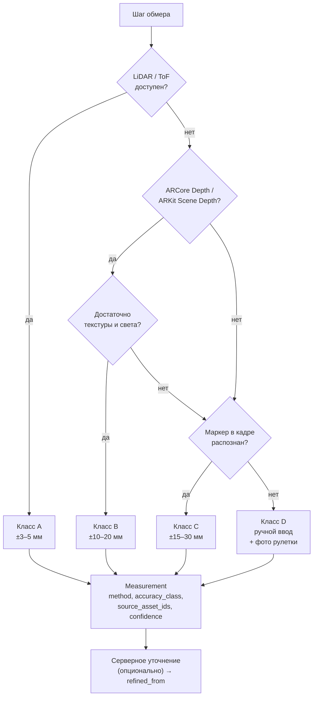

# 05 · Обмер и глубокий анализ единицы товара

> Ответ на требование «самые современные технологии для максимально глубокого
> анализа единиц товара» — с оговоркой, которая и делает решение инженерным:
> современные технологии устаревают, поэтому система построена вокруг **сырья**,
> а не вокруг конкретной модели.

## 5.1 Принцип «raw-first»

Приложение сохраняет не только результат «1200 × 800 × 1450 мм», но и то, из чего
он получен:

- кадры (JPEG/HEIC) и, где доступно, RAW;
- карта глубины (`DEPTH16` / ARKit `sceneDepth`) с картой достоверности;
- облако точек (усечённое, обычно 20–100 тыс. точек);
- интринсики камеры (фокус, главная точка, дисторсия) и поза каждого кадра;
- условия: освещённость, экспозиция, ISO, наличие вспышки, скорость движения;
- маска сегментации объекта, если считалась на устройстве.

Что это даёт: через год модель сегментации станет точнее — мы **пересчитаем габариты
по архиву** вместо повторного выхода бригады на склад. То же для детекции дефектов
и распознавания шильдиков. Стоимость — объём хранения (§5.7), и он окупается первой
же волной пересчёта.

## 5.2 Лестница методов обмера

Четыре класса точности. У каждого — свой метод, свои требования к устройству и
свой честный допуск. **Последняя ступень доступна всегда**, поэтому тупика не бывает.

| Класс | Метод | Требования | Ожидаемая погрешность | Доля устройств |
|---|---|---|---|---|
| **A** | LiDAR / ToF, мультикадровое накопление | iPhone Pro, часть флагманов Android с ToF | ±3–5 мм | ~15 % парка |
| **B** | ARCore Depth API / ARKit Scene Depth (стерео + ML) | Android с поддержкой Depth API, iPhone от XR | ±10–20 мм | ~65 % парка |
| **C** | Эталонный маркер + гомография | Любая камера + печатный маркер ArUco | ±15–30 мм | 100 % |
| **D** | Ручной ввод с рулетки | — | зависит от человека | 100 % |

Правила выбора:

1. Приложение определяет максимально доступный класс **до** начала шага и сообщает
   его пользователю: «Обмер: точность B (ARCore)».
2. Протокол задаёт `min_accuracy_class`. Если устройство не дотягивает — сервер не
   должен был выдавать это задание сюда (§3.7). Если всё же выдал, шаг предлагает
   ступень ниже с явной отметкой в результате.
3. Класс **D всегда требует фотодоказательства**: кадр рулетки на объекте. Иначе
   ручной ввод превращается в способ закрыть задание не выходя из подсобки.
4. Класс записывается в `Measurement.accuracy_class` и никогда не «улучшается»
   задним числом — серверное уточнение создаёт **новую** запись со ссылкой
   `refined_from` (I-5).



## 5.3 Как считается класс B (основной рабочий режим)

1. **Обнаружение опорной плоскости.** ARCore/ARKit даёт плоскость пола или паллеты.
   Она задаёт систему координат и «низ» объекта.
2. **Сегментация объекта.** ML Kit Subject Segmentation (Android) / Vision
   `VNGenerateForegroundInstanceMaskRequest` (iOS) отделяет товар от фона.
   Оба доступны на устройстве, без сети.
3. **Проекция маски на облако точек.** Берём точки глубины внутри маски, отбрасываем
   по карте достоверности (`confidence < 0.5`) и по расстоянию (робастная фильтрация,
   отсечение 2 % хвостов — иначе одна залётная точка на соседнем стеллаже растянет
   габарит на метр).
4. **Ориентированный ограничивающий параллелепипед.** PCA в плоскости опоры даёт
   направление длины; высота берётся по нормали к плоскости. Именно OBB, а не
   AABB: паллета, стоящая под 30° к оператору, при AABB даёт габариты с ошибкой
   до 40 %.
5. **Мультикадровое накопление.** 8–15 кадров с разных ракурсов, медиана по каждому
   измерению. Разброс между кадрами даёт `confidence` — честную оценку, а не
   выдуманное число.
6. **Локальная валидация.** Проверки на здравый смысл: объём > 0, соотношение сторон
   в разумных пределах, габариты не больше 4 м. Провал → предложение переснять.

## 5.4 Класс C: маркер как страховка

Работает на любом телефоне, включая бюджетные Android без AR. Печатный маркер
ArUco 4×4 известного размера (100 мм) кладётся на **ту же грань**, что измеряется.
Дальше — классика компьютерного зрения: детекция углов маркера → гомография →
масштаб пикселей в миллиметры в плоскости маркера.

Ограничение честное и важное: **гомография даёт метрику только в плоскости маркера.**
Высоту приходится брать вторым кадром с маркером на боковой грани. Это медленнее
(два кадра вместо облёта), зато предсказуемо и не зависит от железа.

Практическая деталь, которая решает половину проблем внедрения: маркер печатается
на плотной карточке размером с банковскую и выдаётся вместе с телефоном. Как
запасной вариант поддерживается сама банковская карта (85.6 × 53.98 мм — стандарт
ISO/IEC 7810 ID-1) и лист A4.

## 5.5 Серверный конвейер анализа

Устройство отдаёт сырьё — сервер делает тяжёлую работу асинхронно. Каждый
анализатор независим, падение одного не ломает остальные, результаты пишутся
отдельными записями.

| Анализатор | Вход | Выход | Зачем |
|---|---|---|---|
| **Фотограмметрия / 3D** | Видео-облёт или ≥8 кадров | Меш, объём, уточнённый габарит (класс A′) | Повысить точность там, где на устройстве был класс C |
| **Перекрёстная проверка вес↔объём** | Габариты + вес | Флаг «плотность вне диапазона категории» | Ловит грубые ошибки обмера и подмену товара |
| **Сверка с каталогом** | GTIN + габариты | Отклонение от эталона в % | Ловит пересорт |
| **Детекция повреждений** | Кадры | Bbox + класс дефекта + уверенность | Претензионная работа с поставщиком |
| **OCR шильдика** | Кадр этикетки | Серийник, модель, дата, производитель | Автозаполнение трассировки (§06) |
| **Перцептивный дедуп** | Все кадры | Кластеры похожих съёмок | Ловит «снял одну коробку три раза» |
| **Оценка качества сессии** | Метрики всех шагов | `quality_score`, вердикт | Решение об автоприёме |

Конвейер идемпотентен и **воспроизводим**: у каждого результата записан
`analyzer_version` и хеш входа. Перезапуск на новой версии модели создаёт новую
запись, старая сохраняется. Так можно ответить на вопрос «почему полгода назад
система решила, что это брак» — и это не теоретический вопрос, а первое, что
спросит юрист при споре с поставщиком.

## 5.6 Что считаем «глубоким анализом единицы товара»

Итоговая карточка `ItemRecord` после всех стадий:

```jsonc
{
  "identity":   { "gtin": "...", "serial": "...", "batch": "...", "sku": "..." },
  "geometry":   { "l_mm": 1200, "w_mm": 800, "h_mm": 1450,
                  "volume_m3": 1.392, "accuracy_class": "B", "confidence": 0.91,
                  "refined": { "accuracy_class": "A", "method": "photogrammetry" } },
  "mass":       { "gross_kg": 320.5, "density_kg_m3": 230.2, "density_flag": "ok" },
  "condition":  { "damages": [ { "type": "wrap_torn", "confidence": 0.87, "asset_id": "..." } ],
                  "verdict": "minor_damage" },
  "media":      { "photos": 9, "video_s": 20, "depth_frames": 12, "total_bytes": 184000000 },
  "trace":      { "supplier": { "name": "...", "inn": "...", "confidence": "declared" },
                  "origin_country": "CN", "codes": [ ... ] },
  "quality":    { "score": 0.86, "violations": [ "sides.blur" ], "auto_accepted": true },
  "provenance": { "session_id": "...", "user_id": "...", "device": "...",
                  "protocol": "pallet_general@7", "captured_at": "..." }
}
```

Блок `provenance` обязателен: любая цифра в карточке должна отвечать на вопрос
«кто, чем и по какой инструкции это получил». Без него данные не годятся ни для
претензии поставщику, ни для аудита.

## 5.7 Хранение сырья: цена вопроса

Оценка на одну единицу товара по протоколу `pallet_general@7`:

| Артефакт | Объём |
|---|---|
| 9 фото (12 МП, HEIC) | ~18 МБ |
| Видео-облёт 20 с (1080p) | ~35 МБ |
| 12 карт глубины + облака точек | ~14 МБ |
| Метаданные | < 1 МБ |
| **Итого** | **~68 МБ** |

При 2000 приёмок в месяц — около **1.6 ТБ/год**. Политика жизненного цикла:

- 0–90 дней: горячее хранилище, полный доступ;
- 90–365 дней: холодное (Infrequent Access), доступ по запросу;
- > 365 дней: архив, восстановление часами; **видео удаляется, фото и карты
  глубины остаются** — они дешевле и полезнее для пересчёта;
- по требованию тенанта — WORM-режим (неизменяемость) на весь срок хранения.

Retention настраивается на тенанта: у заказчика с претензионной работой срок
хранения диктуется договором, а не нашими предпочтениями.

## 5.8 Честные ограничения

Их нужно проговорить до внедрения, иначе они всплывут как «система не работает»:

- **Прозрачные и зеркальные объекты** (стекло, полированный металл, стретч-плёнка
  с бликом) ломают любой depth-сенсор. Для них протокол должен принудительно
  ставить класс C или D.
- **Тёмные склады.** Ниже ~50 люкс качество сегментации падает. Решение
  организационное — фонарь на телефоне или налобный, — и оно должно быть в
  инструкции, а не в надежде на алгоритм.
- **Объекты крупнее 4 м** выходят за рабочий диапазон ARCore. Нужен маркер и
  съёмка по частям.
- **Точность класса B зависит от прошивки конкретной модели телефона.** Поэтому
  парк устройств должен быть сертифицирован: перед закупкой модель проходит
  прогон на эталонных объектах, результат записывается в справочник
  `device_capability`. Сервер использует его при раздаче заданий.

Последний пункт — не бюрократия. Разброс качества Depth API между вендорами
Android больше, чем разница между классами B и C, и без калибровочного справочника
система будет уверенно выдавать неверные габариты, не понимая этого.
