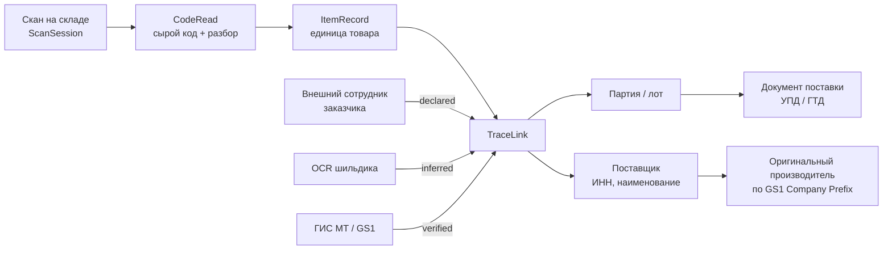

# 06 · Трассировка кодов и оригинальных поставщиков

> Требование заказчика: «сотрудники компаний-заказчиков должны сразу вносить в нашу
> массу данных трассировку кодов и оригинальных поставщиков». Это меняет модель
> доверия: часть данных приходит от людей вне нашего контроля.

## 6.1 Модель доверия — главное решение раздела

Данные о поставщике, введённые сотрудником заказчика, **не равны** данным,
подтверждённым документом или реестром. Смешать их в одном поле — значит один раз
отравить всю базу и никогда не разобраться, где чьё. Поэтому у каждой записи
трассировки есть три обязательных атрибута:

| Атрибут | Значения | Смысл |
|---|---|---|
| `confidence` | `verified` / `declared` / `inferred` | Насколько данным можно верить |
| `declared_by_tenant_id` | UUID тенанта | Чей сотрудник это заявил |
| `evidence_asset_ids` | список кадров | Чем подтверждено |

- **`verified`** — подтверждено машинно: код разобран по GS1 и GTIN найден в
  реестре, либо совпадение с данными «Честного знака», либо сверка с УПД.
- **`declared`** — человек ввёл руками. Это большинство записей от внешних
  пользователей. Полезно, но требует подтверждения.
- **`inferred`** — выведено системой: OCR шильдика, сопоставление по префиксу GS1
  Company Prefix, эвристика по SKU.

Правило потребления: отчёты и выгрузки **всегда** показывают `confidence`.
Агрегаты по умолчанию считаются только по `verified` + `declared`, с раздельными
счётчиками. Никакого «одного числа», за которым не видно происхождения.

## 6.2 Что мы умеем разбирать

### GS1

Основной язык логистики. Приложение разбирает GS1-строки (Application Identifiers)
из `gs1_128`, `data_matrix`, `itf_14`:

| AI | Поле | Пример |
|---|---|---|
| `01` | GTIN | `04607034171234` |
| `10` | Номер партии/лота | `L2026-07` |
| `11` / `15` / `17` | Дата производства / годен до / срок годности | `260728` |
| `21` | Серийный номер | `SN-00918273` |
| `00` | SSCC — код логистической единицы | `304607034100000019` |
| `30` / `37` | Количество | `24` |
| `310n` | Вес нетто, кг | `310300012500` → 12.5 кг |

Из GTIN извлекается **GS1 Company Prefix** — это даёт кандидата на производителя
даже когда поставщик не введён вовсе. Именно так строится `inferred`-связь.

### «Честный знак» (ГИС МТ)

Для маркируемых категорий разбирается код идентификации (КИ/КИЗ): GTIN + серийный
номер + ключ проверки. Приложение проверяет структуру и контрольные символы
офлайн; запрос в ГИС МТ на подтверждение делает **сервер**, асинхронно — иначе
недоступность внешнего сервиса блокировала бы работу склада.

### Прочее

Номер ГТД, артикул поставщика, внутренние коды заказчика — принимаются как
`code_type: custom` с указанием пространства имён тенанта.

## 6.3 Цепочка трассировки



Одна единица товара может иметь **несколько** `TraceLink` — по одному на каждый
заявленный источник. Они не перезаписывают друг друга. Когда `verified`-запись
противоречит `declared`, создаётся `TraceConflict`, и это событие для контролёра:
расхождение между тем, что заявил сотрудник заказчика, и тем, что говорит реестр,
— ровно то, ради чего строится трассировка.

## 6.4 Работа внешних сотрудников

Сотрудник заказчика — полноценный пользователь со своим тенантом, но урезанным
периметром:

| Может | Не может |
|---|---|
| Видеть задания своего тенанта и своих площадок | Видеть чужие задания, даже на той же площадке |
| Выполнять съёмку по выданным протоколам | Менять протоколы |
| Вносить трассировку (`declared`) | Ставить `confidence: verified` |
| Видеть свои карточки единиц товара | Видеть агрегаты по другим тенантам |
| Выгружать свои данные | Выгружать сырьё других тенантов |

Технически это выражено ABAC-политикой (§07), а не отдельной веткой кода:
«внешний» — это набор атрибутов, а не второй продукт. Второй продукт неизбежно
разъедется с первым.

## 6.5 Дедупликация и разрешение сущностей

Поставщик, введённый руками, приходит в пятнадцати написаниях: «ООО Ромашка»,
«Ромашка, ООО», «romashka llc». Стратегия:

1. **Ловим на вводе.** Поле `supplier_name` подсказывает из локальной копии
   справочника (работает офлайн). Выбор из подсказки даёт `supplier_ref` — ссылку
   на канонический контрагент, а не строку.
2. **ИНН как якорь.** Если введён — это сильнейший ключ сопоставления. Формат и
   контрольная сумма проверяются на устройстве.
3. **Серверное разрешение.** Нормализация (регистр, орг-формы, транслитерация) +
   нечёткое сравнение → кандидат на слияние с порогом. Слияние выше порога —
   автоматическое, ниже — в очередь на подтверждение человеком.
4. **Слияние обратимо.** Хранится исходная введённая строка (`raw_input`), так что
   ошибочное слияние всегда откатывается.

Пункт 4 — не перестраховка. Автоматическое слияние контрагентов ошибается на
холдингах с похожими названиями, и необратимое слияние там означает потерю данных.

## 6.6 Интеграция со справочником контрагентов КВАНТ

В репозитории уже есть работающий клиент Bitrix24 (`bitrix_client.py`) и модель
компаний (`company.py`). Справочник поставщиков для приложения **берётся оттуда**,
а не заводится заново:

```
Bitrix24 crm.company.list  ──▶  SupplierDirectory (нормализация, инкремент)
                                        │
                                        ├──▶ sync/pull → локальная копия на устройстве
                                        └──▶ разрешение сущностей при приёме TraceLink
```

Синхронизация инкрементальная, по `updated_at`. На устройство едет усечённая
проекция (id, название, ИНН, алиасы) — обычно 2–5 МБ на тенанта, что спокойно
живёт офлайн.

## 6.7 Что даёт трассировка бизнесу

Прямая ценность, ради которой это строится:

- **Претензия поставщику** с фотодоказательством, привязанным к конкретной партии.
- **Ответ на отзыв продукции**: по коду партии за секунды находятся все единицы,
  где они и что с ними.
- **Выявление пересорта**: заявленный поставщик не совпадает с GS1 Company Prefix
  на упаковке.
- **Аналитика качества поставщиков**: доля повреждённых единиц, отклонения
  габаритов от каталога, доля нечитаемых кодов — по каждому поставщику.

Последний пункт напрямую соединяется с существующим дашбордом Sourcing Analyzer:
данные о фактическом качестве поставок дополняют картину работы сорсеров
реальными фактами со склада, а не только историей переписки.
