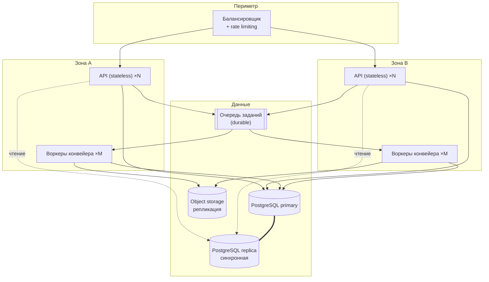

# 08 · Надёжность: «система никогда не должна падать»

> Требование в исходной формулировке недостижимо буквально: любая система когда-то
> откажет. Достижимо другое и более ценное — **отказ никогда не останавливает
> кладовщика и никогда не теряет его работу.** Ниже — как это обеспечивается.

## 8.1 Определение «не падает»

Формулируем измеримо, иначе требование останется лозунгом:

| Свойство | Формулировка | Целевое значение |
|---|---|---|
| **Непрерывность работы** | Кладовщик может выполнить задание при полном отказе бэкенда | 100 % операций, кроме получения новых заданий |
| **Сохранность работы** | Выполненная работа доходит до сервера | ≥ 99.99 % без ручного вмешательства |
| **Доступность API** | Успешные ответы / все запросы | 99.9 % в месяц (43 мин простоя) |
| **Стабильность приложения** | Crash-free sessions | ≥ 99.5 % |
| **Восстановление** | Время восстановления сервиса после отказа зоны | < 15 мин |
| **Потеря данных** | RPO | 0 для событий, < 5 мин для аналитики |

Ключевая строка — первая. Она означает, что доступность бэкенда не входит в
критический путь работы склада. Это и есть настоящий ответ на требование.

## 8.2 Лестницы деградации

Основной приём. У каждой критичной способности — упорядоченный набор реализаций,
последняя из которых работает всегда.

| Способность | 1 (лучшая) | 2 | 3 | 4 (всегда работает) |
|---|---|---|---|---|
| Получение заданий | Push FCM/APNs | Фоновый pull | Ручное обновление | Кэш заданий на устройстве (до 3 смен) |
| Обмер | LiDAR (класс A) | ARCore Depth (B) | Маркер (C) | Рулетка + фото (D) |
| Идентификация | DataMatrix/GS1 | Линейный штрихкод | OCR этикетки | Ручной ввод |
| Справочник поставщиков | Онлайн-поиск | Локальная копия | Ручной ввод строкой | — |
| Отправка данных | Wi-Fi | Мобильная сеть | Отложенная выгрузка | Выгрузка на ПК кабелем (аварийный режим) |
| Аутентификация | OIDC онлайн | Refresh-токен | Офлайн-сессия до 72 ч | PIN + офлайн-режим только на чтение |

Правило разработки: **новая функция не принимается в релиз без описанной ступени
отказа.** Если для неё нет ступени «работает всегда» — функция не критическая и
должна уметь отключаться, не блокируя сценарий.

## 8.3 Режимы отказа и реакция системы

| Что отказало | Что видит кладовщик | Что делает система | Потери |
|---|---|---|---|
| Нет сети | Индикатор «офлайн, N в очереди» | Работа продолжается, outbox копится | Нет |
| Бэкенд лежит целиком | То же, что при отсутствии сети | Retry с backoff, кэш заданий | Нет, кроме новых заданий |
| Объектное хранилище недоступно | Ничего | События уходят, медиа копится, карточка в `media_pending` | Нет |
| БД в режиме read-only (failover) | Ничего | Приём событий буферизуется в очередь, применяется после восстановления | Нет |
| Кончилось место на телефоне | Предупреждение, режим экономии | Снижение битрейта видео, запрет новых заданий, требование выгрузки | Нет — сырьё не удаляется (I-1) |
| Приложение падает | Перезапуск на том же шаге | Состояние в SQLite, сессия восстанавливается по логу | Максимум текущий незавершённый шаг |
| Телефон разряжен/утерян | — | Сессия продолжается на другом устройстве (§4.6) | Невыгруженное тяжёлое медиа |
| Внешняя система (Bitrix/WMS) недоступна | Ничего | Задания из кэша, обратная запись в очереди | Нет |
| Отравленное событие роняет обработчик | Ничего | Poison-pill детектор → карантин события → алерт | Нет |

Последняя строка — важная. Одно некорректное событие, роняющее обработчик очереди,
классически превращается в бесконечный цикл падений и полную остановку конвейера.
Детектор: счётчик попыток на `client_event_id`, после 3 неудач — в `dead_letter`
с алертом, очередь идёт дальше.

## 8.4 Серверная топология

Принципы:

- **API stateless.** Любой инстанс обрабатывает любой запрос; масштабирование и
  выкатка тривиальны.
- **Приём событий отделён от их обработки.** `POST /v1/sync/events` только
  валидирует, пишет в лог и отвечает. Тяжёлая работа — в воркерах. Так пик нагрузки
  в пересменку (вся смена одновременно поймала Wi-Fi) не роняет приём.
- **Синхронная реплика БД** — RPO = 0 для событий.
- **Очередь durable**, с at-least-once доставкой; обработчики идемпотентны — это
  то же требование, что и к приёму событий, и решается тем же ключом.

## 8.5 Ограничение нагрузки и защита от лавины

Реальный пик: смена из 40 человек заканчивает работу, все входят в зону Wi-Fi
одновременно и начинают выгружать по 6 ГБ. Меры:

- **Джиттер на клиенте** при старте синхронизации (случайная задержка 0–120 с).
- **Rate limiting по устройству и по тенанту** на границе, с честным ответом
  `429 + Retry-After`, который клиент уважает.
- **Приоритет метаданных над медиа**: события выгружаются первыми, всегда.
- **Backpressure**: при переполнении очереди API отвечает `503 + Retry-After`
  вместо того чтобы принимать и деградировать. Явный отказ лучше тихого замедления.
- **Автомасштабирование воркеров** по глубине очереди, не по CPU.

## 8.6 Наблюдаемость

Метрики (Prometheus/OTel):

- `sync_lag_seconds` — от `device_ts` до `server_ts`, гистограмма по тенантам.
  Главная метрика здоровья: растёт — где-то встали данные.
- `outbox_depth` — репортится устройствами, агрегируется по площадкам.
- `events_rejected_total{reason}` — рост `permanent` означает баг клиента.
- `asset_upload_failure_ratio`, `checksum_mismatch_total`.
- `measurement_accuracy_class_distribution` — сдвиг в сторону D означает, что
  где-то сломалось AR или люди начали халтурить.
- `crash_free_sessions_ratio` по моделям устройств.
- `pipeline_stage_duration_seconds{analyzer}` и `analyzer_error_total`.

Трассировка: `trace_id` рождается на устройстве и живёт до конца конвейера. Это
позволяет ответить на «что случилось с этой конкретной приёмкой» одним запросом.

Логи: структурированные, с `tenant_id`, `session_id`, `device_id`. **Без ПДн и без
содержимого кодов маркировки** — коды являются коммерческой тайной заказчика.

Алерты, будящие человека ночью (страничные):
`sync_lag_seconds p95 > 15 мин`, `events_rejected_total{permanent} > 1 %`,
`доступность API < 99 %` на 5-минутном окне, `dead_letter` растёт.
Остальное — в рабочее время.

## 8.7 Тестирование надёжности

Без этого раздел выше — благие намерения.

- **Контрактные тесты** мобильного клиента и API по OpenAPI: ломающее изменение
  контракта не проходит CI.
- **Тест офлайн-сценария** в CI: эмулятор без сети проходит полный сценарий,
  затем сеть включается — проверяется, что всё доехало ровно один раз.
- **Хаос-тесты**: случайные обрывы посреди чанковой загрузки, дублирование батчей
  событий, перестановка порядка, часы устройства сдвинуты на ±2 дня.
- **Нагрузочный профиль «пересменка»**: 40 устройств × 6 ГБ одновременно.
- **Прогон на реальном парке**: перед закупкой модели телефона — обмер эталонных
  объектов (§5.8), результат в справочник `device_capability`.
- **Восстановление из бэкапа** — регулярно, по расписанию. Бэкап, который ни разу
  не восстанавливали, бэкапом не является.

## 8.8 Чего мы сознательно не делаем

- **Не делаем мобильное приложение зависимым от сети ни в одной точке.** Цена —
  сложность синхронизации; выгода — работоспособность склада.
- **Не строим мультирегион на старте.** Одна зона + резерв закрывает 99.9 %;
  мультирегион вдвое усложняет консистентность ради процентов, которые никто не
  просил. Точка расширения оставлена: `tenant_id` уже есть в ключах хранилища.
- **Не пытаемся автоматически разрешать все конфликты.** Спорные случаи идут к
  человеку (§4.5). Автоматика, тихо выбирающая между двумя версиями правды, —
  источник инцидентов, которые обнаруживаются через полгода.
