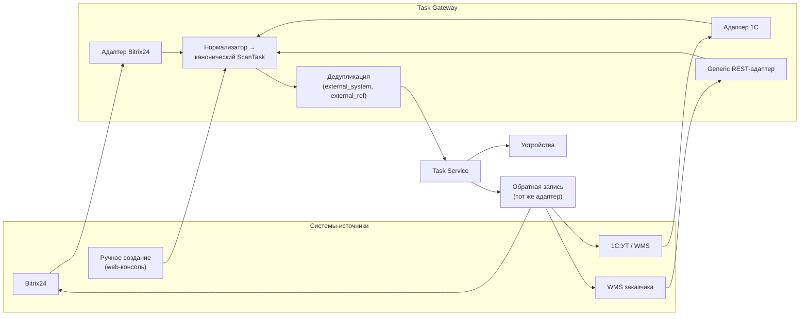
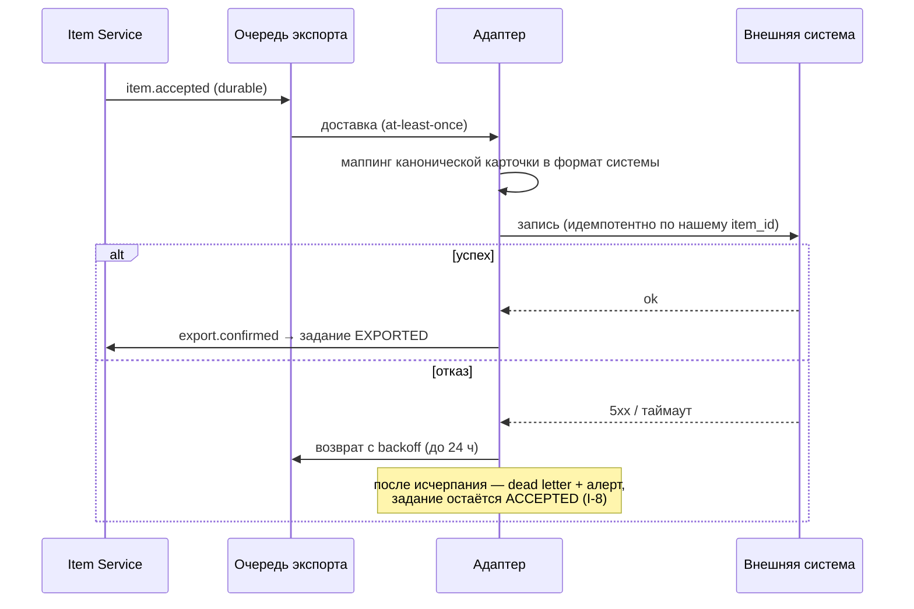

# 09 · Интеграции: приём заданий и обратная запись

> «Задания на сканирование должны приходить из складской системы как триггеры».
> Складских систем у наших заказчиков будет много и разных, поэтому приложение
> не должно знать ни об одной из них.

## 9.1 Развязка через Task Gateway



Приложение видит только канонический `ScanTask`. Новая складская система заказчика
= новый адаптер на сервере. **Мобильный релиз при этом не нужен** — это третья ось
расширения из §1.5.

## 9.2 Два способа приёма

### Webhook (предпочтительный)

```http
POST /v1/inbound/tasks
Authorization: Bearer <integration-token>
Idempotency-Key: wms-acme:REQ-88213
Content-Type: application/json

{
  "external_system": "wms-acme",
  "external_ref": "REQ-88213",
  "site_code": "MSK-1",
  "protocol_code": "pallet_general",
  "subject": {
    "sku": "ART-99120", "gtin": "04607034171234",
    "name": "Кабель ВВГнг 3х2.5, барабан",
    "expected_qty": 1, "location": "A-14-03", "batch": "L2026-07"
  },
  "priority": 50,
  "due_at": "2026-07-28T18:00:00Z",
  "assignee": { "kind": "pool", "value": "receiving" }
}
→ 202 { "task_id": "...", "state": "NEW" }
```

- `Idempotency-Key` **обязателен**. Повторная доставка того же вебхука (а она будет:
  все шлют с ретраями) возвращает тот же `task_id` и не создаёт дубль. Ключ хранится
  30 дней.
- Ответ `202`, а не `200`: задание принято, но ещё не назначено. Источник не должен
  ждать назначения.
- Ошибки валидации возвращаются с указанием поля — интегратору заказчика нужно
  понять, что не так, без нашего участия.

### Опрос (fallback)

Если система заказчика не умеет вебхуки — а 1С в типовой поставке часто не умеет —
адаптер сам ходит за изменениями по расписанию:

```yaml
adapter: bitrix24
mode: poll
interval: 300s
query:
  entity_type_id: 166          # смарт-процесс «Запросы поставщикам»
  filter: { stage_id: ["NEED_SCAN"], ">=updated_at": "{{cursor}}" }
cursor_field: updated_at
```

Курсор персистентный, с перекрытием окна (берём `cursor - 60s`) — так изменения на
границе интервала не теряются, а дедупликация по `external_ref` гасит повторы.

## 9.3 Push как сигнал, а не как транспорт

Когда задание создано и назначено, устройству отправляется data-only push
(FCM / APNs):

```json
{ "type": "sync_hint", "scopes": ["tasks"], "tenant_id": "..." }
```

Внутри — **никаких данных задания**. Push означает ровно одно: «сходи в
`/v1/sync/pull`». Причины:

- Push не гарантирован. Ни FCM, ни APNs не дают доставку; на Android c агрессивным
  энергосбережением (Xiaomi, Huawei, Oppo) потери массовые.
- Данные в push — это утечка при компрометации токена и обход всех трёх рубежей
  изоляции (§7.2).
- Ограничение размера сделало бы формат задания заложником лимита пуша.

Гарантию даёт периодический pull (по умолчанию 15 мин на переднем плане, 1 ч в
фоне) + pull при каждом появлении сети + ручное обновление. Потеря push не приводит
ни к чему хуже задержки в 15 минут.

## 9.4 Обратная запись

После `ACCEPTED` результат уезжает обратно тем же адаптером:



Инвариант I-8 здесь работает так: задание **не считается закрытым**, пока внешняя
система не подтвердила приём. Иначе появляется класс инцидентов «в приложении
приёмка есть, в WMS её нет» — самый неприятный из возможных, потому что
обнаруживается при инвентаризации через месяц.

Что уезжает: габариты с классом точности, коды, трассировка, вердикт качества,
ссылки на медиа (presigned URL с длинным TTL либо копирование в хранилище
заказчика — по договорённости).

## 9.5 Адаптер Bitrix24

Первый и опорный адаптер — переиспользует существующий в репозитории
`bitrix_client.py` (батчинг, троттлинг, ретраи уже реализованы и обкатаны).

| Направление | Метод Bitrix24 | Примечание |
|---|---|---|
| Приём заданий | `crm.item.list` (entityTypeId 166) по фильтру стадии | Курсор по `updatedTime` |
| Реакция на изменение | Исходящий вебхук `ONCRMDYNAMICITEMUPDATE` | Быстрее опроса, но не заменяет его |
| Обратная запись | `crm.item.update` + `crm.timeline.comment.add` | Габариты в UF-поля, ссылки на медиа в таймлайн |
| Справочник поставщиков | `crm.company.list` | Инкрементально, см. §6.6 |

Ограничения Bitrix24, которые адаптер обязан учитывать (и которые уже учтены в
существующем клиенте): лимит 2 запроса/сек на портал, батч до 50 команд, отсутствие
транзакционности между командами батча. Отсюда — обязательная идемпотентность
обратной записи по нашему `item_id`, а не надежда на «команда выполнится один раз».

## 9.6 Контракт «generic REST»

Для заказчика с произвольной системой описан минимальный контракт, который ему
нужно реализовать: один эндпоинт приёма результата и один способ отдать задания
(вебхук к нам либо отдача списка по опросу). Оба описаны в
[`api/openapi.yaml`](api/openapi.yaml) в разделе `inbound`/`outbound`, чтобы
интегратор заказчика мог сгенерировать клиент и не задавать нам вопросов.

Осознанное решение: **мы не пишем адаптер под каждого заказчика бесплатно.** Есть
generic-контракт (заказчик подстраивается) и есть платная разработка адаптера
(подстраиваемся мы). Без этой развилки команда интеграций превращается в
бесконечную очередь.

## 9.7 Версионирование API

- URL-версия (`/v1/`) для ломающих изменений.
- Внутри версии — только аддитивные изменения; неизвестные поля клиенты обязаны
  игнорировать (это записано в контракте и проверяется тестами).
- Deprecation: заголовки `Deprecation` и `Sunset`, минимум 6 месяцев до отключения.
- Мобильные клиенты старше 12 месяцев получают мягкое принуждение к обновлению:
  сначала баннер, потом — запрет на получение новых заданий с сохранением
  возможности **выгрузить уже снятое**. Клиент, которому запретили выгружать
  накопленное, — это потерянные данные, и такого сценария быть не должно.
