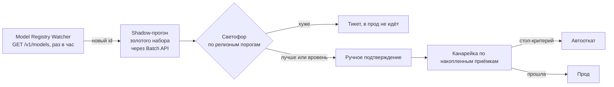

# 11 · Жизненный цикл моделей: дообучение, самосовершенствование, защита от деградации

> Раздел отвечает на два вопроса: **что именно дообучается** и **за счёт чего
> система становится лучше со временем**. Начинается с разграничения, без
> которого весь дальнейший разговор бессмысленен.

## 11.1 Два разных «дообучения», которые нельзя путать

В системе работают модели двух принципиально разных типов, и улучшаются они
по-разному.

| | **Claude** (разбор фото, объяснения, судья качества) | **Собственные CV-модели** (сегментация, детекция повреждений, регрессор глубины) |
|---|---|---|
| Веса обновляются нами | **Нет.** Fine-tuning в этой архитектуре не применяется | **Да.** Это и есть дообучение в прямом смысле |
| Что улучшается | Контекст, промпт, few-shot из своего золотого набора, схема структурированного вывода, выбор модели и `effort` | Веса модели на накопленных данных |
| Как приходит скачок качества | Выход новой версии модели у Anthropic + наш канареечный выкат | Наш цикл переобучения |
| Темп | Раз в 1–3 месяца, извне | Ежемесячно (детектор) / ежеквартально (регрессор) |
| Кто отвечает | Наш промпт-контур и реестр моделей | Наш тренировочный конвейер |

**Прямой ответ на «как встроено дообучение Claude»: оно не встроено, и это
осознанно.** Мы не дообучаем Claude. Требование «всегда самая новая и самая
продвинутая модель» выполняется не подгонкой весов, а тем, что новая модель
обнаруживается за час и проверяется за сутки — см. §11.4. Претендовать на
fine-tuning там, где его нет, было бы враньём в проектной документации.

Что реально даёт прирост на стороне Claude:

1. **Накопленный золотой набор как few-shot.** Примеры из своего склада —
   с этикеткой этого поставщика, с этим типом повреждения — работают лучше
   универсальной модели без контекста. Растёт вместе с архивом.
2. **Справочники в контексте.** Каталог SKU, справочник контрагентов, ряды
   стандартов — подаются в промпт, кэшируются, обновляются без релиза.
3. **Версионирование промпта** наравне с версией модели: `prompt_version`
   пишется в каждый результат, иначе откат неисполним.
4. **Смена модели и `effort` по типу задачи** — маршрутизация, а не одна модель на всё.

## 11.2 Что дообучается на самом деле

| Модель | Что делает | Темп переобучения | Источник меток |
|---|---|---|---|
| Детектор повреждений | Находит и классифицирует дефекты на кадре | Ежемесячно | Вердикт контроля качества, разметка |
| Сегментация объекта | Отделяет товар от фона и паллеты | Ежеквартально | Исправления оператора, разметка |
| Регрессор глубины/масштаба (классы B/C) | Уточняет габариты на слабых устройствах | Ежеквартально | Эталонный перезамер класса A |
| Классификатор категории | Предлагает категорию детали | Ежемесячно | Решение инженера при приёмке |
| Перцептивный дедуп | Ловит повторную съёмку одного объекта | Не обучается (хеши) | — |

## 11.3 Маховик данных — и его честная оценка

Идея: каждая приёмка обязана оставить после себя не только сырьё, но и хотя бы
одну **проверяемую метку, полученную из уже идущего рабочего процесса**, без
заказной разметки.

| Канал | Задержка | На какую модель реально работает |
|---|---|---|
| Исправление оператором предзаполненного поля | секунды | Категория, код, атрибуты |
| Вердикт контроля качества (принято/возврат + причина) | часы | Детектор повреждений |
| Факт возврата или претензии по позиции | 14–60 дней | Грубая сигнализация, не обучение |
| Расхождение объёма с карточкой каталога > 10 % | часы | Слабый сигнал, **загрязнён** (см. ниже) |
| Повторный обмер класса A после C/D | дни | **Габариты — единственный канал** |

### Главная дыра, которую надо назвать вслух

**У обмера нет дешёвого источника истины.** Разметчик, глядя на кадр, может
восстановить категорию, дефект и код — но **не может восстановить габарит в
миллиметрах**. Из пяти каналов на главную метрику (MAE/P95 в мм), за которую
платит заказчик, работает ровно один: повторный замер класса A по тому же
физическому экземпляру. А он требует, чтобы товар ещё не уехал, и стоит времени
склада.

Следствие, которое надо принять и заложить в бюджет: **источник истины по
обмеру процедурный, а не телеметрийный.** Нужен выделенный пост эталонного
перезамера — 40–60 экземпляров в неделю, два независимых замера разными людьми,
поверенный инструмент, оплаченное время склада (≈10 ч/нед + координатор).
Без этой строки метрики обмера недоказуемы, и любое заявление о качестве
габаритов — это мнение, а не измерение.

Два канала загрязнены, и это тоже надо знать:

- **Каталог систематически неверен** (габарит брутто вместо нетто, короб вместо
  единицы, данные поставщика пятилетней давности). Обучаясь на расхождении с
  каталогом, модель тянется к каталогу — а весь смысл продукта в том, что
  каталогу нельзя верить. Канал годится как сигнализация, не как метка.
- **Возвраты и претензии** при 2000 приёмок/мес — это 10–40 событий в месяц с
  неразрешимой атрибуцией: повреждение могло произойти на любом плече доставки.

## 11.4 «Всегда самая новая модель» — механизм

Правила, без которых механизм превращается в лотерею:

1. **Модель никогда не задаётся алиасом в рантайме.** Только явный `model_id`,
   записанный в каждый результат вместе с `prompt_version`, `scenario_version`
   и `effort`. Без этого откат физически невозможен, а на вопрос заказчика
   «почему цифра изменилась» нет ответа.
2. **Автообнаружение — да, автоподмена — нет.** «Самая новая» означает срок
   проверки в сутки вместо месяца, а не подмену модели на всём парке без
   проверки.
3. **Shadow-прогон через Batch API** (−50 % к цене): 500 кейсов золотого набора
   ≈ $26 за прогон. Это дёшево настолько, что проверять можно каждую новую
   модель, не спрашивая бюджет.
4. **Смена модели инвалидирует кэш промпта** — первые часы канарейки дороже.
   Это ожидаемый скачок, он должен быть в стоп-критериях как норма, иначе
   канарейка будет откатываться на ровном месте.
5. **У новой модели свой лимит запросов**, он не наследуется от предыдущей.
   Проверять до переключения, а не после.

### Канарейка считается в наблюдениях, а не в процентах

При 2000 приёмок/мес 5 % трафика — это **3,3 приёмки в сутки**. Лестница
5→25→50→100 % с порогом «300 приёмок на ступень» занимает больше полугода на
один релиз. Критерий «48 часов **или** 300 приёмок» через «или» схлопывается в
48 часов и 7 наблюдений — это не проверка, а её имитация.

Поэтому:

- ступени задаются **накопленными приёмками**, не процентами: не менее 150–200
  на ступень, условие «и», не «или»;
- честный срок полного выката — **4–8 недель**, и так и написано в регламенте
  выката; обещание «сутки» относится **только к shadow-прогону**;
- при 2–5 тенантах привязка по `tenant_id` делает минимальный шаг не 5 %, а
  20–50 % — гранула это целый заказчик. Нужен второй уровень рандомизации
  внутри тенанта: по площадке или по смене.

## 11.5 Защита от самообмана

Три способа, которыми система может тихо деградировать, показывая зелёные метрики.

**1. Петля самоподтверждения.** Модель предзаполняет поле, человек жмёт
«подтвердить» не глядя, метка возвращается как «модель права». Качество падает,
измеряемая доля исправлений остаётся низкой.

Противодействие: в 3 % приёмок поле **не предзаполняется** — ввод вслепую.
Важная поправка к тому, чем это является: **это детектор петли, а не эталон
точности.** Ручной ввод — класс D, σ ≈ 10–20 мм; сравнивать с ним модель с
целевой MAE 5 мм бессмысленно, а 3 % от 2000 приёмок — это 60 наблюдений в
месяц, на которых смещение меньше 4–5 мм не детектируется месяцами.
Как ловушка на автопилот работает; как измерение точности — нет.

**2. Переобучение на метрике.** Два непересекающихся набора: `frozen golden`
(смотрим только на релизе) и `rolling dev` (итерируем ежедневно).
Диагностический признак беды: dev растёт, golden стоит — команда оптимизирует
набор, а не задачу.

**Never-train-list ведётся по происхождению (`client_event_id` / lineage от
точки приёма), а не по хешу файла.** Хеш ломается при любом перекодировании —
ресайз, смена контейнера, пересчёт архива через другой конвейер. С хешем в роли
первичного ключа золотой набор гарантированно протечёт в обучающий пул при
первом же backfill.

**3. Устаревание золотого набора.** Собран на двух площадках в феврале — через
полгода прод работает на шести с другим парком телефонов и другим освещением.
Метрики зелёные, люди жалуются.

Противодействие: квартальная ротация 15 % с обязательной квотой — каждый новый
тенант и каждая модель телефона с >50 приёмок получает представительство;
плюс сравнение распределения слайсов набора и продового потока.

### Про пороги и доверительные интервалы

Золотой набор в 500–1000 кейсов **не обеспечивает** релизных порогов по слайсам:
классы точности × форма × поверхность дают 8–15 слайсов, ≈40 кейсов на слайс.
P95 по выборке из 40 — фактически второй по величине элемент, его доверительный
интервал шире, чем разница между «релиз прошёл» и «не прошёл».

Поэтому на старте: **один агрегированный порог по классу точности**, раскладка
по слайсам — диагностика без права блокировать релиз. Метрики публикуются с
доверительными интервалами (bootstrap), а не точечными числами: 12 ± 6 мм и
15 ± 7 мм неразличимы, и это должно быть видно.

То же с монитором дрейфа: при 65 приёмках в сутки на слайс приходятся единицы
наблюдений. Правило «хуже на 2σ три дня подряд» даст либо шум, либо тишину.
«Минутная петля» на таком объёме физически не существует — честный горизонт
недельный.

## 11.6 Пересчёт архива

Raw-first (ADR-0008) окупается здесь: когда выходит более сильная модель, архив
пересчитывается без повторного выхода бригады.

- Год архива (24 000 приёмок) через Batch API: ≈ $1 220 на `claude-opus-5`,
  ≈ $735 на `claude-sonnet-5`. **Полный пересчёт года стоит меньше месяца
  работы одного разметчика.**
- Ограничитель — не деньги, а обязательства. Пересчёт запускается при
  улучшении ≥10 % относительных на золотом наборе в значимом слайсе, при
  появлении новой способности (тип дефекта, которого не умели ловить), или по
  запросу заказчика в споре. Ниже 5 % — не запускается, чтобы не плодить версии.
- Результаты **append-only**: пересчёт создаёт новую `measurement_version`,
  предыдущая остаётся; API поддерживает `?as_of=`.
- Версии, вошедшие в подписанные акты или претензионную переписку, помечаются
  `frozen` — пересчёт по ним публикуется только справочно.
- В оферте должно быть зафиксировано, **какая версия расчётная, а какая
  справочная.** Без этого уведомление «мы пересчитали, объём изменился на 6 %»
  заблокируют коммерческая и юридическая службы — если по объёму выставлялись
  счета, тихая замена цифры недопустима.

## 11.7 Данные заказчиков: три уровня согласия

| Уровень | Что разрешено | Реальность |
|---|---|---|
| 0 (по умолчанию) | Не используются для обучения вообще | Стартовое состояние |
| 1 | Только калибровка внутри своего тенанта | Крупные заказчики соглашаются почти всегда |
| 2 | Обезличенно в общую модель | Крупные заказчики **почти никогда** не соглашаются |

Каждый обучающий пример несёт `tenant_id` и `consent_level`; перед попаданием в
пул — обязательная очистка: детекция лиц, документов и ценников с закупочными
ценами, блюр. Право на удаление исполнимо технически: вычистка пула +
переобучение в ближайшем плановом релизе, с явным SLA.

**Следствие, меняющее приоритеты.** Раз уровень 2 практически недостижим,
общая модель будет учиться на данных наших собственных площадок — то есть на
систематически не той популяции, ради которой строится контур. Поэтому
**подгонка поправочных коэффициентов на слайс** (площадка × класс точности ×
тип упаковки) по локальным меткам поднимается из «исследовательского» в
**основной рычаг качества первого года**: она работает на уровне согласия 1,
не требует переобучения и юридически чиста.

## 11.8 Экономика: честные цифры

Считать инфраструктуру без людей — типовая ошибка, поэтому здесь оба слоя.

| Статья | При 2000 приёмок/мес |
|---|---|
| Онлайн-инференс Claude (`opus-5`, ~16 400 вход / 800 выход) | ≈ 16 000 ₽/мес |
| Релизные прогоны золотого набора + судья (Batch) | ≈ 12 000 ₽/мес |
| Разметка (400 задач/мес, двойная на 10 %) | ≈ 19 000 ₽/мес |
| Хранение (136 ГБ/мес, холодное через 90 дней) | 1 200 → 2 000 ₽/мес |
| GPU: переобучение и эмбеддинги | 20 000–55 000 ₽/мес |
| **Инфраструктура итого** | **≈ 70 000–105 000 ₽/мес** |
| **Люди: ML-инженер 1.0, дата/бэкенд 0.5, технолог разметки 0.3** | **≈ 700 000 ₽/мес** |
| **Полная стоимость контура** | **≈ 800 000 ₽/мес → ~380 ₽ на единицу товара** |

Разово: постройка контура — 6–9 человеко-месяцев; стартовый золотой набор по
обмеру — 330–500 часов эталонных замеров (не 8 минут на позицию, как кажется:
воспроизводимая метрология — это 2–3 независимых замера по каждой оси с
фиксацией условий и оснасткой).

**Вывод, который надо сказать заказчику прямо: полный MLOps-контур при 2000
приёмок в месяц не окупается.** Пересчёт годового архива стоит 98 000 ₽, а год
работы контура — около 9 млн ₽.

### Тонкая стартовая конфигурация

| Делаем сразу (≈0,5 FTE + 15–20 тыс ₽/мес) | Откладываем до 20–30 тыс приёмок/мес |
|---|---|
| Label Store (append-only метки) | Active-Learning Sampler |
| Замороженный золотой набор | Тренировочный конвейер собственных моделей |
| Реестр моделей + shadow-прогон | Переобучение регрессора глубины |
| Канареечный роутер с записью версий | Полноценный монитор дрейфа |
| Per-tenant калибровка коэффициентов | Собственная сегментация вместо готовой |

До этого объёма Active-Learning, GPU-конвейер и переобучение не окупают ни
железо, ни инженера.

## 11.9 Что мы сознательно не делаем

- **Не дообучаем Claude.** Это не поддерживается в выбранной архитектуре и не
  нужно: прирост даёт смена версии модели, а не подгонка весов.
- **Не подменяем модель автоматически.** «Всегда новейшая» — про скорость
  проверки, а не про автоподмену.
- **Не считаем LLM-судью независимой мерой.** Модели одного поставщика делят
  слепые зоны; судья годится для ранжирования и приоритизации, решение о релизе
  принимается по человеческой выборке. И порог согласия 85 % на 100 кейсах имеет
  доверительный интервал ±7 п.п. — отличить 85 % от 78 % на такой выборке нельзя.
- **Не строим «минутную петлю» мониторинга.** На объёме 65 приёмок в сутки её
  не существует; обещать её — вводить заказчика в заблуждение.
- **Не полагаемся на кэш промпта как на рычаг экономии.** Доминируют
  изображения, они уникальны и не кэшируются; при интервале между запросами
  ~9 минут пятиминутный TTL промахивается почти всегда.
- **Не переписываем уже отданные результаты.** Молчаливая замена цифры
  разрушает доверие сильнее исходной ошибки.
