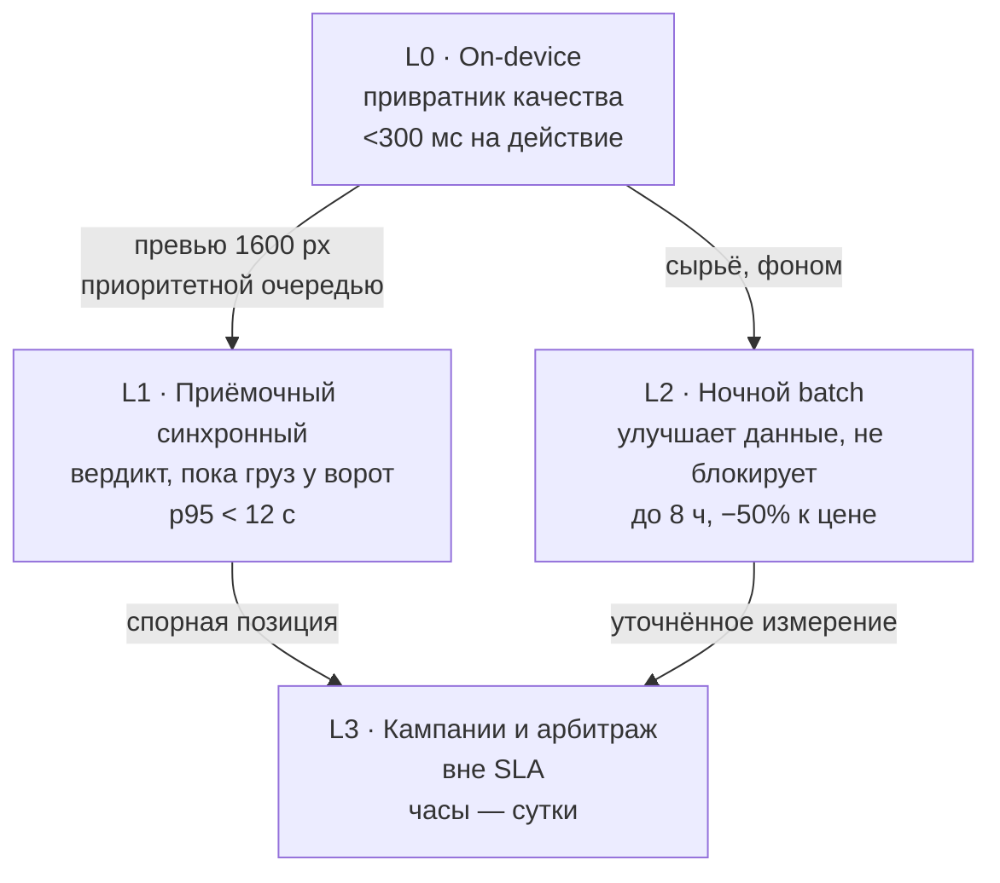

# 12 · ИИ-слой и вычислительный конвейер

> Ответ на требование «заложи сторонние вычислительные мощности, чтобы всегда
> помогала самая продвинутая и самая новая ИИ-модель, и чтобы приложение было
> сильным, а не линейкой с фото».
>
> Раздел написан по результатам проектной проработки с независимой проверкой
> каждого решения. Там, где проверка опровергла исходное предложение, оставлен
> результат проверки — включая случаи, когда красивая функция вычеркнута.

## 12.1 Единица учёта: позиция, а не приёмка

**Единица — позиция (строка SKU) в приёмке, а не приёмка целиком.** При 2000
приёмок в месяц и ~25 позициях в документе это **50 000 позиций/мес**, коридор
планирования 30 000–80 000.

Это не педантизм: ошибка в этом числе делает недействительной всю финансовую
модель. Точное среднее число строк в документе берётся из Bitrix за 3 месяца
**до** утверждения бюджета.

Не все позиции обрабатываются одинаково, и правило отбора детерминированное —
оно записывается в событие, а не решается моделью:

| Поток | Доля | Что делается |
|---|---|---|
| Лёгкий | 100 % | Коды + 2 кадра + гейт качества. Инференс ≈ 0 |
| Полный | ~12 % (6 000/мес) | Обмер, сценарий съёмки, синхронный ИИ-разбор |
| Глубокий | ~1,5 % (750/мес) | Ночная фотограмметрия, претензия, арбитраж |

## 12.2 Четыре слоя по SLA

Ключевая мысль: слои разделены **не по технологии, а по тому, кого они
блокируют**.



### L0 — устройство: привратник качества и источник сырья

Детерминированный CV **без нейросетей**: резкость (Лаплас + Tenengrad),
клиппинг гистограммы, доля бликовых пикселей, интеграл гироскопа. Детектор
объекта 320×320 INT8 для ROI и автоспуска. Чтение кодов и разбор GS1 с
контрольной суммой. Обмер. Захват сырья с интринсиками, позами и вектором
гравитации. Подпись события ключом из аппаратного хранилища.

Два решения, которые здесь важнее остальных:

1. **Гейт качества маркирует, а не блокирует.** Жёсткая блокировка только на
   физически пустом или полностью смазанном кадре. Жёсткий порог по резкости на
   однотонном гофрокартоне даёт массовые ложные срабатывания и за неделю
   обучает кладовщика снимать стену.
2. **Превью 1600 px генерируются при съёмке и идут отдельной приоритетной
   очередью впереди сырья.** Это единственная конфигурация, при которой
   синхронный разбор укладывается в окно приёмки: 68 МБ сырья на складском
   Wi-Fi идут минутами, 300 КБ превью — секунды.

### L1 — приёмочный синхронный контур: главное исправление

`claude-sonnet-5` онлайн, `effort: medium`, строгая `json_schema`: разбор
шильдика и этикетки, сверка заявленного поставщика с упаковкой, детект
пересорта, вердикт «принять / задержать / переснять». p95 < 12 с, жёсткий
таймаут 25 с с деградацией на детерминированные правила.

**Почему это критично, а не «приятно иметь».** Вердикт «пересорт», пришедший
через час, приходит когда машина уехала и накладная подписана — расхождение
юридически превратилось из недопоставки в скрытый недостаток с другой
процедурой доказывания. Окно приёмки машины 20–60 минут, значит модель обязана
участвовать в решении **синхронно**. Это исправление ошибки, которая была во
всех исходных вариантах проработки: самая ценная функция была отправлена в
ночной батч и обесценена.

**Эскалация на `claude-opus-5` — по детерминированному триггеру, а не по
самооценке модели:** пустое критичное поле, противоречие между полями, провал
контрольной суммы GS1 AI / VIN / IMEI, несовпадение с детерминированным OCR
после нормализации карты путаниц символов (O/0, I/1, 5/S, 8/B, Z/2).

Пока триггер субъективен, доля эскалаций уползает с 20 % к 60 % без единой
изменённой строки кода, и счёт становится неуправляемым.

**Артикул никогда не автокорректируется** по нечёткому сопоставлению — только
top-N кандидатов и подтверждение человеком (см. §12.6).

### L2 — ночной batch: улучшает данные, не блокирует операцию

`claude-haiku-4-5` через Batch API (−50 %): сплошной судья качества сессии по
100 % позиций, нормализация контрагентов, профили поставщиков, пересборка
адаптивного сценария съёмки. На GPU-пуле: сегментация SAM 2, TSDF-фьюжн RGB-D,
эмбеддинги, переиндексация.

Две неочевидные детали:

- **Кэш промпта здесь сознательно не используется.** Внутри батча запросы идут
  параллельно, а запись кэша читаема только после начала стриминга первого
  ответа — заявленный hit rate внутри батч-окна недостижим, и `cache_control`
  добавляет только 1,25–2× за запись.
- **Ночной аудит — источник статистики, но не механизм пересъёмки.** К утру
  паллета размещена в ячейке, и «список сессий на пересъёмку» превращается в
  задание найти уехавший груз. Блокирующий контроль качества живёт в L1.

### L3 — кампании и арбитраж

Агентский разбор спорной приёмки: `claude-opus-5`, `effort: xhigh`, tool use,
6–8 вызовов с накоплением контекста. Генерация проекта претензии — с
обязательным юристом в контуре. Выборочный пересчёт архива (§12.7).

## 12.3 «Всегда самая новая модель» — реестр ролей

**В коде и промпт-шаблонах нет ни одной строки вида `claude-opus-5`.** Есть
таблица:

```sql
model_binding(role, model_id, params_json, prompt_version,
              schema_version, status, weight, data_policy)
```

Роли: `acceptance-extractor`, `escalation-judge`, `session-auditor`,
`defect-classifier`, `doc-writer`, `dispute-agent`. Откат — это `UPDATE`
указателя, а не деплой бэкенда.

**Обнаружение.** Cron раз в час дёргает `GET /v1/models`, диффит снапшот по `id`
и по дереву `capabilities`. Проверка пригодности модели для роли — программная,
по конкретным путям, а не по памяти разработчика:

```python
caps["image_input"]["supported"]
caps["thinking"]["types"]["adaptive"]["supported"]
caps["effort"]["xhigh"]["supported"]
caps["structured_outputs"]["supported"]
```

Это снимает целый класс ошибок 400: `output_config.effort` поддерживается на
opus-5 / sonnet-5 / fable-5, но **не** на haiku-4-5 — роль `session-auditor` не
должна получать `effort` вообще, и это обязано следовать из реестра, а не из
комментария в коде.

**Гейт.** Золотой набор — 1000 размеченных позиций, стратифицированный по
тенанту, категории и типу тары, из которых 15 % с заведомо нечитаемым шильдиком
для проверки правила «не видно — `null`». Сравнение кандидата с baseline —
**парным тестом McNemar на одних и тех же кейсах**, а не порогом по точке: при
n = 300 и p ≈ 0,9 стандартная ошибка доли ±1,7 п.п., то есть порог «не хуже
0,5 п.п.» лежит глубоко внутри шума.

Метрика «доля нарушений схемы = 0» из гейта исключена: при `strict` она
константа по построению и сигнала не несёт.

**Раскатка** — в наблюдениях, а не в процентах: не менее 200 позиций на ступень,
условие «и» по времени и объёму. Честный срок полного выката 4–8 недель;
обещание «сутки» относится только к shadow-прогону. Подробнее — §11.4.

## 12.4 Что делает приложение сильным

Функции упорядочены по отношению пользы к сложности, а не по эффектности.

| Функция | Слож. | Этап | Суть |
|---|---|---|---|
| **Автозаполнение по истории** | S | 1 | До любого распознавания карточка предзаполняется по прошлым подтверждённым приёмкам этого SKU и поставщика. **Ноль инференса, 60–90 секунд экономии на позицию** — лучшее отношение пользы к сложности во всём списке |
| Гейт качества + слот-планировщик кадра | M | 1 | 33–58 человеко-часов/мес непроизошедших пересъёмок |
| **Приёмочный вердикт за 12 секунд** | M | 2 | ИИ участвует в решении, пока груз у ворот. 2,8 ₽ на вызов |
| Детерминированная эскалация | S | 2 | Делает счёт управляемым |
| Реестр ролей моделей | M | 2 | Обновление модели — операция данных, а не инцидент |
| Обмер с измеренными допусками | L | 3 | Цифра, которую можно защитить перед контрагентом |
| **Кросс-контроль плотностью** | S | 3 | BLE-весы: вес / расчётный объём. Ловит перепутанную грань, захват соседнего короба, ошибку масштаба маркера — то, что модель не видит как ошибку |
| Append-only измерения с заморозкой | M | 3 | Защита от ретроактивных финансовых дельт |
| Доказательный пакет | M | 3 | nonce → хеш-цепочка → RFC 3161 → crypto-shredding |
| Визуальный индекс SKU, арбитр пересорта | L | 4 | Один пойманный пересорт перекрывает месячный бюджет ИИ |
| **Адаптивный сценарий по профилю поставщика** | M | 4 | Ночная аналитика переписывает подписанный JSON сценария: у проблемного поставщика добавляются ракурсы углов. **Без релиза приложения** |
| Ночная фотограмметрия по узкому правилу | L | 5 | MVS-точность там, где габарит идёт в тариф или в спор |
| Change detection «пришло уже битым» | L | 6 | Доказательная база в споре с перевозчиком |
| Автопретензия с юристом в контуре | M | 6 | 15–30 минут оформления → 30 секунд проверки |

Две функции стоит выделить, потому что они опровергают интуицию:

- **Самая полезная функция не использует ИИ вообще.** Автозаполнение по истории
  — это работа с накопленной БД. Она даёт больше сэкономленного времени, чем
  любой разбор изображения, и стоит ноль.
- **Кросс-контроль плотностью** — независимый детектор грубых ошибок обмера за
  цену BLE-весов. Порог задаётся по категории и типу тары, а не единым ±25–30 %:
  плотность внутри категории различается кратно.

## 12.5 Требования к телефонам

Вынесены в отдельный раздел: [13-device-requirements.md](13-device-requirements.md).

Коротко: два уровня вместо трёх — **A** (LiDAR, эталонный пост) и **C**
(маркерный обмер, рабочее большинство), плюс **R** (морозильник) и **D** (чужой
несертифицированный парк). Класс B на ARCore Depth из проекта исключён —
обоснование в §12.8.

## 12.6 Экономика

Полный расчёт с допущениями — в исходной проработке; здесь итог.

| Статья | ₽/мес | ₽/позицию |
|---|---:|---:|
| Claude API (все шесть ролей + гейты моделей, с наценкой посредника) | 133 000 | 2,67 |
| GPU (выделенный узел + burst у РФ-провайдера) | 67 000 | 1,34 |
| Бэкенд (PostgreSQL HA, очередь, k8s, наблюдаемость) | 200 000 | 4,00 |
| Хранилище и трафик | 47 000 | 0,94 |
| Устройства (амортизация 24 мес, MDM, бой, эксплуатация парка) | 166 000 | 3,32 |
| **Техническая себестоимость** | **613 000** | **12,3** |
| **Люди (стационар, 5–6 FTE)** | **2 800 000** | **56** |
| **Итого, один заказчик, 50 000 позиций/мес** | **3 410 000** | **68** |

Три вывода, каждый из которых меняет решение:

1. **Вычисления — 4 ₽ из 68 ₽.** Claude и GPU вместе дают 6 % полной
   себестоимости. Спорить о выборе модели, экономя копейки на токенах, при
   доминирующей строке «люди» — потеря времени.
2. **Экономика сходится только при мультитенантности.** Один заказчик — 68 ₽ за
   позицию; три заказчика на 150 000 позиций — ~28 ₽. Это не деталь роадмапа,
   а условие окупаемости.
3. **Год 1 — это инвестиция, а не себестоимость.** ~162 ₽ за позицию при 8 FTE
   на стройке. Защищать её надо как инвестицию в разработку, иначе цифра
   выглядит провалом.

**Главная оговорка, которую нельзя пропустить.** Обоснование «ошибка 10 мм по
стороне = 2,8 % объёма паллетоместа» арифметически верно, но превращается в
деньги **только при объёмном тарифе**. При тарификации по паллетоместам или по
весу — а это большинство складских договоров — выигрыш от метрологической
точности ровно нулевой. Письменное подтверждение заказчика, что его тариф
объёмный, требуется **до** начала инвестиций в обмерный контур.

## 12.7 Пересчёт архива — кампания, а не автоматика

Ключ результата содержит `model_id`, значит новая модель формально обесценивает
всю историю. Соблазн «вышла новая модель → пересчитали всё» стоит дорого:
600 000 накопленных позиций через opus в батче — порядка **6,8 млн ₽ за одну
кампанию**, при 2–4 релизах в год это больше, чем весь остальной конвейер.

Поэтому: флаг «подлежит пересчёту» в ключе; кампания запускается **по выборке**
(позиции с расхождениями + N % случайных + новые SKU); бюджет считается в
токенах и GPU-часах заранее; замороженные измерения не трогаются. 88 % рутинного
потока новая модель не трогает никогда.

## 12.8 Что вычеркнуто и почему

Этот список важнее списка функций: он показывает, где проверка остановила
дорогие ошибки.

| Вычеркнуто | Почему |
|---|---|
| **Feed-forward multi-view реконструкция и 3D Gaussian Splatting** | Две независимые причины, каждой достаточно. Лицензии: DUSt3R/MASt3R некоммерческие, оригинальный 3DGS research-only, OpenMVS под AGPL-3.0 с сетевым копилефтом, срабатывающим именно на SaaS. По существу: рендер — это модель, а не доказательство; в споре вес имеют исходные кадры. Выживают BSD/Apache-чистые COLMAP/GLOMAP и SAM 2 |
| **Класс точности B на ARCore Depth** | На устройствах без ToF это depth-from-motion: 2–6 % дистанции, то есть 20–60 мм на 1–3 м, и он разваливается ровно на типовой складской таре — стрейч, чёрный матовый пластик, белый гофрокартон, глянец. ToF из Android-флагманов вымер после 2021 г. Экономит 0,4–0,6 млн ₽ CAPEX и месяцы разработки не в ту сторону |
| **Горячий путь уточнения обмера (p95 < 90 с)** | Приёмка позиции занимает 30–60 секунд — никто не ждёт полторы минуты, а к моменту прихода уточнения паллета обмотана и увезена. Контракт другой: provisional-габарит мгновенно и всегда, refined — к концу смены, новой записью |
| **Compliance Object Lock на 3 года на сырьё** | Физическая невозможность удаления несовместима с правом на удаление по 152-ФЗ, с выходом тенанта, со случайной загрузкой паспорта в кадр. Неудаляемым остаётся только манифест; сырьё — crypto-shredding: удаление ключа = удаление данных при сохранённой доказуемости целостности |
| **Автокоррекция артикула по нечёткому сопоставлению** | В реальных каталогах артикулы штатно отличаются одним символом (`-220V` / `-110V`). Нормализатор молча подставит соседний SKU с высокой уверенностью и **создаст ровно тот пересорт, который система должна ловить**. Расстояние Левенштейна ≤2 одновременно принимает серийник с двумя ошибками и бракует корректный при путанице O/0. Заменено на: нормализация карты путаниц → точное совпадение → контрольная сумма формата |
| **GTIN-префикс как признак страны производства** | Распространённый миф. Префикс GS1 идентифицирует организацию-члена, выдавшую номер, а не место производства. Ложная претензия к поставщику на этом основании — юридический риск |
| **Голосовая грамматика на 60–80 команд и диктовка чисел** | При фоне 75–90 дБ пары «двенадцать/двадцать», «тринадцать/тридцать» путаются системно, а обязательное визуальное подтверждение съедает весь выигрыш. Остаётся 10–15 команд по push-to-talk; числа и коды — кнопками и сканером. Выделенный GPU под распознавание речи тоже вычеркнут: 17 часов аудио в месяц разбираются ночью на одном CPU-ядре |
| **Антифрод-сигналы, не переживающие контакта со складом** | Барометр (дрейф по погоде больше межэтажного перепада), детекция ШИМ (складской LED сам даёт ШИМ и бэндинг на rolling shutter), микротремор IMU (фотостол на посту — легитимная практика). Заменено на активный вспышечный челлендж и проверку параллакса по короткой серии |
| **Блок детекции внутреннего подлога в первой очереди** | Арифметика не сходится: 12–15 слабых сигналов по «или» при 1 % ложных срабатываний каждый дают сессионный FPR ~11 %, а не заявленные 2 % — это 400–800 ручных разборов в месяц, которых нет в смете. Очередь 1 — доказуемость против **поставщика**; детекторы против своих — только после измерения фактических потерь и минимум 3 месяца в shadow-режиме |

## 12.9 Что это меняет в роадмапе

- **Добавлен этап 0** (4–6 недель, ~700 тыс ₽) с тремя гейтами, каждый из
  которых может остановить целое направление: юридико-инфраструктурный (доступ к
  API из РФ-контура, аудит лицензий всего стека **до** прототипа),
  метрологический (Gage R&R на 4 критичных типах тары), коммерческий
  (письменное подтверждение объёмного тарифа).
- **Переставлены этапы 1 и 2.** Первым идёт связка «гейт качества + коды +
  автозаполнение по истории» — она не требует ни инференса, ни сети, ни
  метрологии, и уже даёт 60–90 секунд на позицию.
- **ИИ-слой расщеплён по SLA на два разных этапа.** Синхронный приёмочный
  контур и ночной batch — разные компоненты с разной экономикой; попытка
  сделать их одним этапом отправляла самую ценную функцию в батч.
- **Метрология разделена на измерение и публикацию.** До завершения Gage R&R
  запрет на любые миллиметры в коммерческом предложении технический, а не
  организационный: `U` отдаётся как `null`, UI показывает «допуск не установлен».
- **Добавлен явный этап мультитенантности** с автотест-канарейкой «искусственный
  SKU тенанта A не появляется в выдаче тенанту B» и полноценной веткой класса D.
  Без него продукт продаётся только в комплекте с железом на 1,9 млн ₽.
